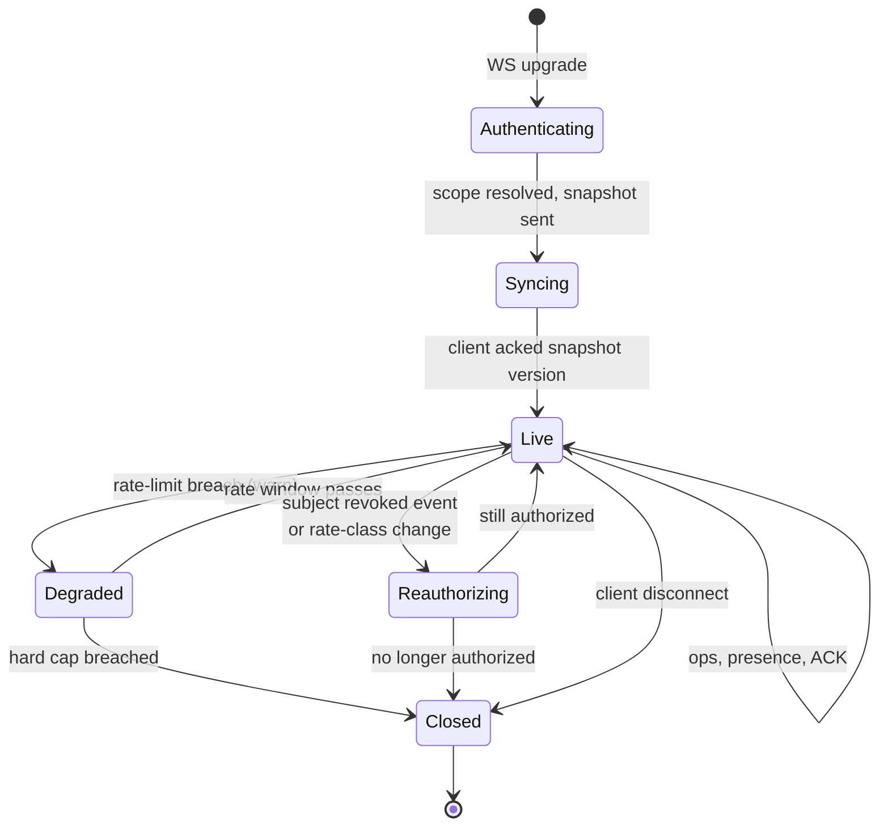
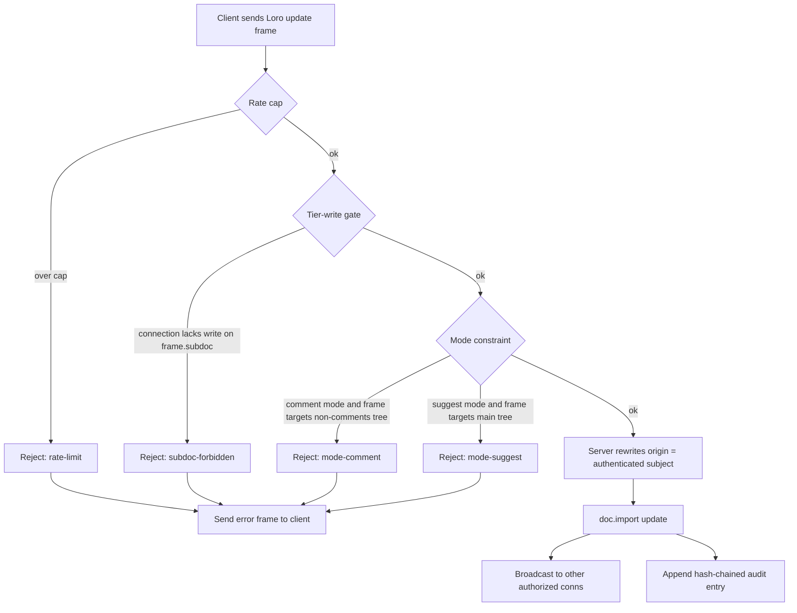

# Access Control — Detailed Design

> Companion spec to [`architecture.md` §6](architecture.md#6-sync-architecture). Where architecture.md sketches the five primitives, this doc fills in the implementation: schemas, state machines, protocols, attack scenarios, and the explicit gaps.

## 0. Scope and Threat Model

> **Recontextualized by [ADR 0005](./adr/0005-trust-model.md).** weaver is designed for a **cooperative-organization, trusted-server** deployment: the org runs weaver on its own Cloudflare account; users are authenticated org members (not adversaries); the sync server is operationally trusted. Access control's job is **org-level data scoping with audit-grade attribution**, not zero-trust insider defense. The threat model below reflects that.
>
> External corroboration: Jazz's [post-mortem on classic Jazz](https://jazz.tools/blog/what-we-learned-from-classic-jazz) reports that a purely cryptographic, zero-trust permission model produced rules that were "hard to evolve once baked into the system," and that "some useful permission rules still wanted at least a semi-trusted authority somewhere." Their v2 pivot — *"lean into the Jazz server as a trusted authority responsible for enforcing usefully complex permission policies that can evolve over time"* — lands at the same model this spec starts from. We treat that as empirical evidence that policy belongs in tables + tokens (D1 ACL + Biscuit caveats), not in CRDT-embedded signed records. Crypto guards **attribution** (origin tags, hash-chained audit log) and **delegation** (Biscuit attenuation); it does not encode **policy**.

### In scope

- Per-document and per-subdoc read/write access (org-level scoping).
- Per-mode product affordances (read-only, comment, suggest, write, admin) — enforced as UI gating + tier-write gate at the DO; not as a hardening boundary against insiders.
- AI agents as distinct subjects with **attenuated grants** that bound prompt-injection blast radius (see [ADR 0006](./adr/0006-ai-agent-threat-model.md)).
- Cryptographic attribution (every op tied to an authenticated subject) for compliance reporting.
- Revocation with bounded propagation latency.
- Audit-grade hash-chained log.
- Tamper-resistance of the audit log itself (defending the log against external/post-hoc modification, not against the original author).

### Out of scope (v1)

- **Defending against authenticated insiders crafting hostile CRDT updates** (per ADR 0005 — cooperative-user model). Insider misbehavior is an HR + audit-review concern, not a runtime-validator concern.
- End-to-end encryption — explicitly rejected (D16). Content is plaintext to the server, which is fine because we trust it.
- Defending against the server operator (E2E territory).
- Information-theoretic privacy of presence (we filter awareness, but a determined network observer can infer activity from traffic timing — see §18).
- Content-based DLP (we don't classify content; if a user pastes a credit card into a public subdoc, that's the user's choice).
- Multi-tenant isolation against hostile co-tenants (we don't ship a hosted multi-tenant build in v1; ADR 0005 §"Multi-tenant variant" notes the path).

### Adversaries

| Adversary | Capabilities | What we defend |
|---|---|---|
| **A1: Unauthenticated network** | Sniff WS traffic, attempt connections | TLS terminates at Cloudflare edge; WS upgrade rejected without valid token. |
| **A2: Authenticated but unauthorized user** | Has a valid token for *some* docs; tries to access others | D1 ACL lookup at upgrade; subdoc partitioning at sync layer; tier-write gate at the DO. |
| **A3: Prompt-injected AI agent** *(the sharp one)* | Holds a legitimate attenuated token; agent's behavior is driven by hostile doc content trying to exfiltrate or escalate | Capability scope enforced server-side regardless of prompt; tools derived from token at session start; `requires_user_confirmation` on destructive ops. Full treatment in [ADR 0006](./adr/0006-ai-agent-threat-model.md). |
| **A4: Stolen capability token** | Holds a valid Biscuit; original subject doesn't know | Short token lifetimes; revocation list in KV; key rotation; session-binding caveat. |
| **A5: External audit-log tamperer** | Has read/write on R2 audit objects (e.g. compromised cloud admin, accidental overwrite) | Hash-chain integrity; latest hash exported off-host. Re-derivation reveals tampering. |
| **A6: Sidechannel observer** | Watches DO event timing, broadcast fan-out | Out of scope; documented in §18. |

### Adversaries explicitly out of scope (per ADR 0005)

| Removed adversary | Why |
|---|---|
| ~~Authenticated user, malicious within their scope~~ | We trust org members; misbehavior is HR. |
| ~~Authenticated user crafting malformed Loro updates to violate schema~~ | Schema validation moves to client + plugin contract; the DO doesn't enforce it as a security boundary. |
| ~~Authenticated user forging `origin` to fake attribution~~ | DO still rewrites `origin` (attribution primitive) but we don't log "forge attempts" — it just doesn't work. |
| ~~Authenticated user op-flooding to DoS peers~~ | Per-doc op-rate cap stays as basic ops protection, not adversary-class. |

---

## 1. Identity and Subjects

Every actor is a *subject*. Subject types use a flat string prefix; namespacing is the only convention.

| Prefix | Meaning | Issuer |
|---|---|---|
| `user:{ulid}` | Authenticated human | Auth Worker after IdP exchange |
| `agent:{ulid}` | AI agent acting on behalf of a user | Auth Worker via user-initiated delegation |
| `link:{ulid}` | Anonymous share-link grantee | Auth Worker, issued at share creation |
| `service:{name}` | First-party backend (e.g. importer, migrator) | Auth Worker, rare, audited |
| `role:{name}` | Role used in ACL rows, never directly authenticates | (none — derived) |

Identities are immutable. Renaming a user changes their display name in metadata; the `user:{ulid}` stays the same forever. This is load-bearing for audit log integrity.

---

## 2. Capability Tokens — Biscuit

> See [ADR 0004](./adr/0004-capability-token-format.md) for the full alternatives review (Biscuit vs Macaroons vs UCAN vs JWT+scopes vs others), revaluation triggers, and the wrapper-interface design that makes the choice swappable.

### Dual-token pattern

weaver uses two token layers, each doing what it's good at:

```
External IdP (Google/Okta/...)
   ↓ OAuth2/OIDC
Auth Worker
   ↓ short-lived JWT (session, identity, refresh)
Browser
   ↓ exchange JWT for a Biscuit on doc open
   ↓ Biscuit (per-doc capability, attenuable for agents/share-links)
Durable Object
```

JWT covers session/identity (ubiquitous, debuggable). Biscuit covers per-doc capability (attenuable, offline-verifiable). Don't conflate them.

### Why Biscuit for the capability layer (not JWT)

- **Attenuation**: a token holder can derive a stricter sub-token without going back to the issuer. Critical for delegating to agents and creating share links.
- **Offline verifiable**: signature + caveat chain verify in the DO with no D1/KV round-trip on the hot path.
- **Datalog policy language**: caveats are expressed as a tiny logic language, not a JSON blob with ad-hoc fields. Easier to audit and harder to misinterpret.
- **Designed for capabilities**, not bearer-style identity. Matches our model.

JWT remains in the stack at the session layer only.

### Token shape

A Biscuit is a chain of `Block`s, each carrying facts + rules + checks, signed with an Ed25519 key chain. Root block signed by our auth service; attenuated blocks signed by the attenuator.

```
// Root block — issued by auth Worker
authority:
  subject("user:01H8K6Z…");
  workspace("workspace:42");
  issued_at(2026-05-17T08:00:00Z);
  expires_at(2026-05-17T20:00:00Z);

check if time($t), $t < expires_at(2026-05-17T20:00:00Z);
```

```
// Attenuated block — issued by user delegating to an agent
attenuation:
  // narrow to a specific doc
  check if doc($d), $d == "doc:01H8K7…";
  // narrow to a subdoc tier
  check if subdoc_tag($s), $s in ["public", "internal"];
  // narrow to specific actions
  check if action($a), $a in ["read", "comment", "tool:text.rewrite"];
  // narrow lifetime
  check if time($t), $t < 2026-05-17T09:00:00Z;
  // bind to a specific agent ID
  subject("agent:01H8K8…");
```

### Issuance flow

```mermaid
sequenceDiagram
  participant U as User browser
  participant IdP as IdP (Google/etc.)
  participant Auth as Auth Worker
  participant KV as Workers KV (revocations)
  participant Client as Client

  U->>IdP: OAuth flow
  IdP-->>U: id_token
  U->>Auth: POST /auth/exchange (id_token)
  Auth->>Auth: verify id_token; lookup user_id
  Auth->>Auth: build root Biscuit (subject, workspace, exp)
  Auth-->>U: { biscuit, exp }
  Note over U: Token kept in memory + sessionStorage<br/>(not localStorage — XSS scope)
  U->>Client: Use biscuit for WS upgrade
```

### Attenuation for agents and share-links

The user's browser performs the attenuation locally (Biscuit's offline-verifiable design enables this). Server only needs to verify, not issue, the attenuated block.

```ts
import { Biscuit } from "@biscuit-auth/biscuit";

function delegateToAgent(rootToken: Biscuit, agentId: string, scope: AgentScope): Biscuit {
  return rootToken.attenuate(`
    check if doc($d), $d in [${scope.docs.map(quote).join(",")}];
    check if action($a), $a in [${scope.actions.map(quote).join(",")}];
    check if subdoc_tag($s), $s in [${scope.subdocs.map(quote).join(",")}];
    check if time($t), $t < ${scope.expiresAt.toISOString()};
    subject("agent:${agentId}");
  `);
}
```

The attenuated token is given to the agent client. The agent **cannot remove** any check — Biscuit's check semantics are monotonic (more checks = stricter).

### Verification path (hot path inside DO and at WS upgrade)

```ts
import { verifyBiscuit } from "./biscuit";

const result = verifyBiscuit(token, publicKey, {
  facts: [
    `time(${nowIso()})`,
    `doc("${docId}")`,
    `action("${action}")`,
    `subdoc_tag("${subdocTag}")`,
  ],
});
// result: { subject, workspace, scope } | TokenInvalid | TokenExpired | CaveatFailed
```

This runs in **<1ms** in WASM at the edge and again per-op in the DO (cached per connection, re-verified on TTL boundaries).

### Revocation

Revocation is the inverse of issuance. Two layers:

1. **Per-token revocation** — token's `revocation_id` (Biscuit primitive) is written to KV with the token's expiry as TTL. DO checks KV on connect and periodically (every 60s) for active connections.
2. **Per-subject revocation** — write `revoked_subjects:{subject}:{since_ts}` to KV. DO checks subject against this; if `token.issued_at < since_ts`, the connection is closed.

KV propagation is **eventually consistent ≤60s globally**. For higher-urgency revocations, write to a Durable Object–backed broadcast channel that fans out to all DOs in the colo:

```ts
// In RevokeWorker
await env.REVOKE_BROADCAST.get(env.REVOKE_BROADCAST.idFromName("global")).fetch("/revoke", {
  method: "POST",
  body: JSON.stringify({ subject, since: Date.now() }),
});
```

Sub-second propagation in practice, with KV as the durable backstop.

### Key rotation

- Auth Worker signs with key `weaver-auth-v{n}`; current `n` published in a public `/.well-known/biscuit-keys` JSON.
- DO fetches the keyset, caches with TTL 5 min.
- Rotate by adding key `v(n+1)` to the keyset, then deprecating `vn` (still verifiable for grace period), then removing `vn` (revokes all `vn`-signed tokens).
- Compromised key: cut the keyset to `v(n+1)` only, force re-auth.

---

## 3. ACL Store (D1)

Capability tokens carry the *bounds* of a grant; D1 holds the *current* ACL. Tokens are checked against D1 at WS upgrade (and on subject revalidation) so revoking access in D1 takes effect for new connections without waiting for token expiry.

### Schema

```sql
-- Workspaces are the unit of org-level grouping.
CREATE TABLE workspaces (
  id            TEXT PRIMARY KEY,                    -- 'workspace:01H…'
  name          TEXT NOT NULL,
  created_at    INTEGER NOT NULL
);

-- Documents.
CREATE TABLE docs (
  id            TEXT PRIMARY KEY,                    -- 'doc:01H…'
  workspace_id  TEXT NOT NULL REFERENCES workspaces(id) ON DELETE RESTRICT,
  title         TEXT,
  created_by    TEXT NOT NULL,                       -- subject
  created_at    INTEGER NOT NULL,
  tier_layout   TEXT NOT NULL DEFAULT 'standard'     -- 'standard' | 'custom'
);
CREATE INDEX docs_workspace ON docs(workspace_id);

-- Subdocs (access tiers). Each row is one Loro doc on the wire.
CREATE TABLE subdocs (
  id            TEXT PRIMARY KEY,                    -- 'subdoc:01H…'
  doc_id        TEXT NOT NULL REFERENCES docs(id) ON DELETE CASCADE,
  tag           TEXT NOT NULL,                       -- 'public' | 'internal' | 'confidential' | …
  created_at    INTEGER NOT NULL,
  UNIQUE(doc_id, tag)
);
CREATE INDEX subdocs_doc ON subdocs(doc_id);

-- Grants — one row per (subject, resource, action).
CREATE TABLE grants (
  id            TEXT PRIMARY KEY,
  subject       TEXT NOT NULL,                       -- 'user:…' | 'agent:…' | 'link:…' | 'role:…'
  resource_type TEXT NOT NULL,                       -- 'doc' | 'subdoc' | 'workspace'
  resource_id   TEXT NOT NULL,
  action        TEXT NOT NULL,                       -- 'read' | 'write' | 'comment' | 'suggest' | 'admin' | 'tool:…'
  granted_by    TEXT NOT NULL,
  granted_at    INTEGER NOT NULL,
  expires_at    INTEGER,                             -- nullable; null = no expiry
  reason        TEXT                                 -- optional audit string
);
CREATE INDEX grants_lookup ON grants(subject, resource_type, resource_id);
CREATE INDEX grants_expiry ON grants(expires_at) WHERE expires_at IS NOT NULL;

-- Role memberships — flatten roles into per-subject grants at issue time,
-- but keep the source for explainability.
CREATE TABLE role_members (
  role          TEXT NOT NULL,                       -- 'role:editors'
  subject       TEXT NOT NULL,
  workspace_id  TEXT NOT NULL REFERENCES workspaces(id) ON DELETE CASCADE,
  granted_at    INTEGER NOT NULL,
  PRIMARY KEY (role, subject, workspace_id)
);
CREATE INDEX role_members_subject ON role_members(subject);

-- Share links — denormalized for lookup.
CREATE TABLE share_links (
  token_id      TEXT PRIMARY KEY,                    -- Biscuit revocation_id
  subject       TEXT NOT NULL,                       -- 'link:01H…'
  doc_id        TEXT NOT NULL REFERENCES docs(id) ON DELETE CASCADE,
  created_by    TEXT NOT NULL,
  created_at    INTEGER NOT NULL,
  expires_at    INTEGER,
  revoked_at    INTEGER
);
CREATE INDEX share_links_doc ON share_links(doc_id);
```

### Lookup contract

At WS upgrade, the auth Worker resolves the **effective action set** for `(subject, doc, subdoc-tag)`:

```sql
-- Pseudocode; in practice this is a CTE or two queries.
SELECT DISTINCT g.action
FROM grants g
LEFT JOIN role_members rm ON rm.role = g.subject AND rm.subject = :subject
WHERE
  (g.subject = :subject OR rm.subject IS NOT NULL)
  AND (
    (g.resource_type = 'doc' AND g.resource_id = :doc_id)
    OR (g.resource_type = 'subdoc' AND g.resource_id IN (
          SELECT id FROM subdocs WHERE doc_id = :doc_id AND tag = :subdoc_tag
        ))
    OR (g.resource_type = 'workspace' AND g.resource_id = (
          SELECT workspace_id FROM docs WHERE id = :doc_id
        ))
  )
  AND (g.expires_at IS NULL OR g.expires_at > :now);
```

Result is the *union* of grants from direct subject ACLs, role memberships, and workspace-level cascades.

### Resolved effective scope (passed to DO)

The Worker passes the resolved scope to the DO in trusted headers:

```
x-weaver-subject:        user:01H8K6Z…
x-weaver-doc:            doc:01H8K7…
x-weaver-actions:        read,write,comment,suggest,tool:text.rewrite
x-weaver-subdoc-allow:   public,internal
x-weaver-subdoc-deny:    confidential
x-weaver-token-id:       01H8L…
x-weaver-mode:           write              # write | comment | suggest | read
x-weaver-rate-class:     standard           # standard | trusted | service
```

DO trusts these headers because the DO is only reachable via Workers in the same Cloudflare account (no public route).

---

## 4. Connection Lifecycle

### WS upgrade flow

```mermaid
sequenceDiagram
  participant C as Client
  participant W as Auth Worker
  participant D1 as D1 ACL
  participant KV as KV revocations
  participant DO as Durable Object
  participant Loro as LoroDoc in DO

  C->>W: WS upgrade /ws/:docId<br/>Sec-WebSocket-Protocol: weaver.v1, <biscuit>
  W->>W: verify Biscuit (offline)
  alt invalid / expired
    W-->>C: 401
  end
  W->>KV: GET revoked_tokens:{token_id}
  alt revoked
    W-->>C: 401
  end
  W->>KV: GET revoked_subjects:{subject}
  W->>W: compare to token.issued_at
  alt subject revoked since
    W-->>C: 401
  end
  W->>D1: resolve effective scope
  alt no read permission
    W-->>C: 403
  end
  W->>DO: forward upgrade with x-weaver-* headers
  DO->>DO: parse headers; create ConnectionState
  DO->>Loro: snapshot authorized subdocs at current version
  DO-->>C: WS accepted + initial snapshot
  Note over C,DO: Steady-state loop in §6
```

### DO connection state machine



`ConnectionState` lives in DO memory:

```ts
type ConnectionState = {
  ws: WebSocket;
  subject: string;
  tokenId: string;
  tokenExp: number;
  doc: string;
  mode: "read" | "comment" | "suggest" | "write";
  actions: Set<string>;
  subdocsAllowed: Set<string>;
  subdocsDenied: Set<string>;
  rateClass: "standard" | "trusted" | "service";
  bytesIn: RingBuffer;       // for rate limiting
  bytesOut: RingBuffer;
  opsIn: RingBuffer;
  lastSeenVersion: Map<SubdocId, VersionVector>;
  ephemeralKeys: Set<string>;
};
```

---

## 5. Read Scoping — Subdoc Partitioning

### The model

Every doc has one or more **subdocs**, each a separate `LoroDoc`. A subdoc represents a single access tier. The default layout is `standard`:

```
doc:01H… (parent metadata only)
├── subdoc:01H…/public          (everyone with read on doc sees this)
├── subdoc:01H…/internal        (read+ on internal)
└── subdoc:01H…/confidential    (read+ on confidential)
```

The parent doc holds **metadata only** (title, tier layout, references). Tier subdocs hold the actual content trees. Subdocs are real LoroDocs — each has its own version vector and update stream.

### Why "one LoroDoc per tier" instead of "one LoroDoc, container-level filtering"

Considered both. Chose **separate LoroDocs** because:

1. **Sync stream isolation is automatic.** Restricted-tier updates literally never enter the WS frame for unauthorized clients. Container-level filtering would require us to decompose each update by container ID and produce filtered re-encodings on every relay — fast in Loro, but a non-trivial attack surface (one bug = leakage).
2. **Snapshot delivery is trivial.** "Send snapshot of subdocs X, Y to this client" is one Loro export call per subdoc.
3. **Tier removal is clean.** Deleting a tier = deleting that LoroDoc; no compaction across mixed-tier ops needed.
4. **Operationally simpler.** R2 snapshot keys are per-subdoc; cold storage scales independently per tier.

Cost: cross-tier references (a public block linking a confidential block) become stored container IDs with a tier tag — see §15.

### Snapshot delivery on connect

```ts
// In DO, on WS accepted
async function sendInitialSnapshot(conn: ConnectionState) {
  for (const tag of conn.subdocsAllowed) {
    const subdoc = this.subdocs.get(tag);
    if (!subdoc) continue;
    const snapshot = subdoc.export({ mode: "snapshot" });
    conn.ws.send(framedMessage({
      type: "snapshot",
      subdoc: tag,
      version: subdoc.version(),
      payload: snapshot,
    }));
  }
  conn.ws.send(framedMessage({
    type: "snapshot-complete",
    subdocs: [...conn.subdocsAllowed],
  }));
}
```

Restricted subdocs are not enumerated — the client doesn't even learn that `confidential` exists if they aren't authorized for it. If the user needs to be told "more content exists you can't see," that's a metadata field in the parent doc that the UI surfaces, not a sync-level signal.

### Live updates

After snapshot-complete, the DO relays updates per-subdoc to authorized connections:

```ts
async function relayUpdate(conn: ConnectionState, subdocTag: string, update: Uint8Array) {
  if (!conn.subdocsAllowed.has(subdocTag)) return;     // hard gate
  conn.ws.send(framedMessage({
    type: "update",
    subdoc: subdocTag,
    payload: update,
  }));
  conn.bytesOut.record(update.byteLength);
}
```

Hot path is fast (no Loro decode needed for relay).

### Cross-tier references

A public block can carry an inline reference to a confidential block (e.g. "see the analysis in [link]"). Representation:

```ts
// Stored in the public subdoc, on the citing block:
{
  type: "cross-tier-ref",
  target: { subdoc: "confidential", containerId: "tree:abc123" },
}
```

Render-time resolution:

- Viewer authorized for `confidential`: dereference, render block contents inline or as a card.
- Viewer not authorized: render `[Restricted block — request access to confidential tier]` placeholder.
- The container ID **is itself information** (a stable handle). For high-paranoia layouts, hash the target ID with a per-doc secret known only to the DO; the placeholder shows an opaque hash. Default layout: plain container ID, since revealing "a confidential block exists" is usually acceptable.

---

## 6. Write Scoping — Tier-Write Gate

> **Trust-model note ([ADR 0005](./adr/0005-trust-model.md)):** Earlier drafts of this section described an elaborate per-op decomposition pipeline (Loro diff → mode check → schema check → cross-tier-ref check → origin-forge logging) as a *security boundary* against malicious authenticated insiders. Under the cooperative-organization trust model that's not the right shape. This section is rewritten accordingly: write scoping reduces to a tier-write gate. Schema validation moves to client + plugin contract, with server-side sanity checking as content integrity, not as adversarial defense.

### The gate

Every inbound Loro update frame from a client passes through:



The pipeline is **frame-level**, not op-level. A frame either lands wholly or fails wholly. No partial accepts.

### Implementation sketch

```ts
async function onIncomingUpdate(conn: ConnectionState, frame: UpdateFrame) {
  if (conn.mode === "read") {
    return notifyError(conn, frame, "read-only");
  }

  // Basic operational rate cap (not adversary-class — see ADR 0005)
  if (!conn.opsIn.tryConsume(1)) {
    return notifyError(conn, frame, "rate-limit");
  }

  // Tier-write gate — the load-bearing scoping check
  if (!conn.subdocsAllowed.has(frame.subdoc)) {
    return notifyError(conn, frame, "subdoc-forbidden");
  }
  if (!conn.canWrite(frame.subdoc)) {
    return notifyError(conn, frame, "subdoc-readonly");
  }

  // Mode constraint (product affordance, not security boundary)
  if (conn.mode === "comment" && frame.subdoc !== `${frame.subdoc}/comments`) {
    return notifyError(conn, frame, "mode-comment");
  }
  if (conn.mode === "suggest" && !frame.subdoc.includes("/suggestions/")) {
    return notifyError(conn, frame, "mode-suggest");
  }

  // Origin rewrite — attribution primitive (kept regardless of trust model)
  const stamped = loro.stampOrigin(frame.payload, { origin: conn.subject });

  // Server-authoritative apply
  this.subdocs.get(frame.subdoc)!.import(stamped);
  this.appendAudit(conn, frame.subdoc, stamped);

  // Per-tier filtered broadcast
  for (const other of this.connections.values()) {
    if (other === conn) continue;
    if (!other.subdocsAllowed.has(frame.subdoc)) continue;
    relayUpdate(other, frame.subdoc, stamped);
  }
}
```

That's the whole hot path. No Loro diff decomposition for security; no per-op rejection list; no client rollback bookkeeping beyond "you got a frame error, surface it."

### Schema validation — content integrity, not security

Schema rules (per node-kind, Effect Schema) still exist. Their purpose under the new trust model:

- **Client-side**: typed mutators in `@weaver/core` make it hard to produce invalid updates by accident. Pre-commit validation rejects buggy plugin code locally.
- **Plugin contract**: plugin authors declare `concurrentSemantics` and schema; the plugin can't register a node-kind that doesn't validate.
- **Server-side**: a periodic *content-integrity sweep* in the DO walks the LoroDoc and quarantines any container that fails schema. This catches stale-client bugs after the fact; it does not gate the hot path. Quarantined content surfaces in a UI lane for the doc owner to repair.

This costs less than per-op validation, defends against the actually-likely failure mode (a stale client with an old schema), and matches the trust model.

### What the schema layer covers

Same as before — kept for reference:

- Allowed attribute keys and types
- Required attributes (e.g. heading level must be 1–6)
- Allowed children types
- Length / size caps (e.g. block text not longer than 100 KB)
- Mark compatibility (e.g. `code` mark cannot overlap with `link`)
- ACL tags must be from the configured tier set

Schema violations are **content-integrity events**, not security events. They feed the integrity sweep and the quarantine lane; they don't reject frames in the hot path.

---

## 7. Client Error Handling (Simplified under ADR 0005)

> **Trust-model note:** Previous drafts described an elaborate per-op-id rollback protocol for partial-reject scenarios from the DO. Under the tier-write gate (§6 above), frames either land wholly or fail wholly; partial rejects don't happen on the security path. This section is correspondingly simplified.

### Optimistic apply

Clients apply ops locally immediately for responsiveness:

```ts
function localCommit(ops: PendingOp[]) {
  doc.transact(() => {
    for (const op of ops) op.apply(doc);
  }, { origin: localSubject });
  const update = doc.exportFrom(lastSentVersion);
  outgoingQueue.push({ frameId, update });
  lastSentVersion = doc.version();
}
```

### Server response cases

| Server response | Client action |
|---|---|
| `ack { frameId }` | Drop from outgoing queue. |
| `error { frameId, reason: "rate-limit" }` | Back off; replay queue; toast user if persistent. |
| `error { frameId, reason: "subdoc-forbidden" }` | UndoManager.undo the whole frame; surface "You don't have write access here" — usually a UI bug if it happens at all (the UI should have prevented the attempt). |
| `error { frameId, reason: "subdoc-readonly" }` | Same as above; surface "Read-only here." |
| `error { frameId, reason: "mode-comment" / "mode-suggest" }` | Same; UndoManager.undo the frame. Indicates a UI bug. |
| `revoked { code: 4001 }` | Close WS; UI to read-only-stale state; offer re-auth. |
| `integrity-quarantine { containerId, reason }` | Async server-initiated message: a container failed the integrity sweep and was moved to the quarantine lane. UI shows a banner; doc owner can repair. |

### What's gone

- **No `op_ids` field on rejections.** Frames are atomic.
- **No `UndoManager.undoSpecific(op_ids)`**. UndoManager.undo on the last frame is enough.
- **No "5 ops accepted, 1 rejected" scenario** on the security path. Either you can write to the subdoc or you can't.

Schema-integrity quarantines are an async, server-initiated flow — not a synchronous rejection — so they don't enter the rollback path.

### Convergence guarantee

The system converges if and only if:

1. The server's authoritative LoroDoc state is the source of truth.
2. Every accepted update is broadcast to every authorized peer.
3. Every rejected op on a client is locally undone before the next user input causes a follow-on op.

(2) and (3) together mean every peer eventually applies the same set of ops in CRDT-merge order. Even if a client misbehaves and *doesn't* roll back a rejected op locally, the peer's state simply diverges from the server's; other peers continue from the server's view.

---

## 8. Origin Tagging and Audit

### Origin metadata

Loro changes carry an arbitrary metadata object. We standardize:

```json
{
  "origin": "user:01H8K6Z…",
  "client_id": "client:tab-uuid",
  "ts": 1715000000000,
  "op_id": "uuid"
}
```

The server **overwrites `origin`** on relay using the authenticated subject. Client-supplied `origin` is discarded. `client_id`, `ts`, `op_id` are preserved for client-side correlation.

### Audit log row

Every accepted update produces one audit row, written async to Workers Analytics Engine (queryable) and to R2 (immutable).

```ts
type AuditEntry = {
  v: 1;
  ts: number;
  doc: string;
  subdoc: string;
  subject: string;            // authoritative
  mode: "write" | "suggest" | "comment";
  rate_class: string;
  op_kinds: string[];          // e.g. ["text:insert", "text:mark", "tree:create"]
  op_count: number;
  bytes: number;
  rejected_count: number;
  reasons: Record<string, number>;  // rejection-reason histogram
  prior_hash: string;           // hash of previous audit row in this doc
  hash: string;                  // sha256(prior_hash || row_body)
};
```

### Hash-chain integrity

Per (doc, subdoc), audit rows form a hash chain. `hash[i] = sha256(hash[i-1] || canonical_serialize(row[i]))`. The DO holds the latest hash in memory; on cold start it reads it from R2.

Tampering with R2 entries is detectable: re-deriving the chain from origin reveals any modification. The DO also publishes the latest hash periodically to an external append-only log (R2 bucket with object-lock or a Cloudflare D1 row) for off-host verification.

### R2 layout

```
weaver-audit/
  doc=doc:01H…/
    subdoc=public/
      year=2026/month=05/day=17/hour=08/
        00000-00099.ndjson        (100 rows per object; gzipped)
        00100-00199.ndjson
```

### Per-user history view

Query Analytics Engine:

```sql
SELECT ts, op_kinds, op_count, bytes
FROM audit
WHERE doc = ?
  AND subject = ?
  AND ts BETWEEN ? AND ?
ORDER BY ts;
```

Available to admins; available to users for their own subject (for "what did I do today").

---

## 9. Suggestion Mode

### Mechanics

Suggestion mode uses Loro's `fork()` to create a per-author branch.

```ts
// On client when user enters suggestion mode
const fork = mainSubdoc.fork();
// All edits go into `fork`. The fork's updates are exported
// and sent to the server with mode="suggest".
```

The server tracks per-suggester forks as **first-class LoroDocs** named `subdoc:{id}/suggestions/{author}`. Suggestions can be edited concurrently by multiple authors without stepping on each other.

### Permission model

- Subject in `suggest` mode can write **only** to their own suggestion fork.
- Subject with `read` on the main doc and `read` on suggestion forks (configurable) can see overlay diffs.
- Doc owner / admin can accept or reject a suggestion fork.

### Accept flow

```ts
async function acceptSuggestion(
  main: LoroDoc,
  fork: LoroDoc,
  acceptingSubject: string,
) {
  // Compute the diff fork → main
  const update = fork.exportFrom(main.version());
  // Apply to main with origin = (acceptor, suggester)
  main.import(update, { origin: { acceptor: acceptingSubject, suggester: fork.peer } });
  // Mark suggestion as merged in metadata
  meta.set("suggestions", forkId, { status: "merged", merged_at: Date.now() });
  // Optionally delete the fork subdoc after a grace period.
}
```

If the main doc has moved since the fork was created (likely!), the merge is a normal CRDT merge — concurrent edits in main are preserved, the suggester's edits are added. If a true conflict exists (e.g., main deleted the block the suggestion targeted), the suggestion's edits land in a "ghost" tombstone position — UI flags this for the acceptor to resolve manually.

### Reject flow

Reject = delete the fork subdoc; record metadata.

---

## 10. Comment Mode

### Mechanics

Comments live in a sibling `LoroTree` named `comments` on the main subdoc (not in a separate subdoc — comment visibility usually mirrors the doc tier).

```ts
type Comment = {
  id: string;
  author: string;          // subject
  range: { from: Cursor; to: Cursor };   // Loro stable cursors anchored in the main content tree
  body: LoroText;
  replies: LoroTree;       // recursive
  created_at: number;
  resolved: boolean;
  resolved_by?: string;
};
```

### Permissions

Subject in `comment` mode can:

- Create new comments anchored to any range they can read
- Append text to **their own** comment body
- Edit / delete **their own** comment
- Mark comments as resolved if they have `write` on the doc (configurable: comment authors can resolve their own; admins can resolve any)

The op validator routes `comment` mode writes to the comments tree only; any op outside is rejected.

### Cursor robustness

Comments anchored on stable Loro `Cursor`s survive concurrent edits to the main content. If the entire anchored range is deleted, the cursor enters an "orphaned" state — UI renders the comment in a side panel marked "anchor lost," doesn't delete it.

---

## 11. Agent Delegation

### Issuance

A user delegates to an agent via Biscuit attenuation (§2). Server **does not** issue agent tokens directly; this would require the auth Worker to know what tools each agent should have. Instead, the user (or a client app acting for the user) decides scope at delegation time, attenuates locally, and sends the result to the agent runtime.

```ts
// User's browser, when starting an agent task
const agentToken = userToken.attenuate(`
  check if doc($d), $d == "${currentDoc}";
  check if subdoc_tag($s), $s in ["public", "internal"];
  check if action($a), $a in [
    "read",
    "tool:text.rewrite",
    "tool:format.toggle",
    "tool:summarize"
  ];
  check if time($t), $t < ${new Date(Date.now() + 3600_000).toISOString()};
  subject("agent:${spawnAgentId()}");
`);
postToAgentRuntime({ token: agentToken, task });
```

The agent runtime (a separate Worker that runs LLM calls) holds the token and uses it to open a WS to the DO.

### Server-side enforcement

The DO sees the agent as just another subject. All §6 validation applies. **Critical**: the agent's available tools are not negotiated; they are derived server-side from the token's caveats:

```ts
function resolveAgentTools(conn: ConnectionState): ToolDef[] {
  const declared = pluginRegistry.listTools(conn.doc);
  return declared.filter((tool) =>
    conn.actions.has(`tool:${tool.name}`)
    && conn.subdocsAllowed.has(tool.requiredSubdoc),
  );
}
```

The agent client receives the tool catalog from the DO at session start. It cannot invoke a tool not in the catalog because op validation rejects ops it would have produced.

### Revocation

User can revoke an agent's token in the same way as their own:

```ts
await env.AUTH.fetch("/revoke", {
  method: "POST",
  body: JSON.stringify({ token_id: agentTokenId }),
});
```

DO sees revocation broadcast, closes the agent's WS, audit-logs the revocation. Agent client surfaces "Access revoked by user."

### Per-agent rate limits

Agents typically have a `rate-class: agent` configured tighter than `standard` users (e.g. 30 ops/s vs 5 ops/s — agents *can* hit higher op rates than humans because they stream tokens). The rate-class is on the token and enforced in DO.

---

## 12. Ephemeral / Presence Filtering

Loro's `EphemeralStore` carries non-persistent state (cursors, selections, "typing" indicators, agent activity scope).

### Per-tier filtering

Ephemeral entries are tagged with the subdoc they apply to. The DO filters fan-out:

```ts
function relayEphemeral(entry: EphemeralEntry, exclude: ConnectionState) {
  for (const conn of this.connections.values()) {
    if (conn === exclude) continue;
    if (!conn.subdocsAllowed.has(entry.subdoc)) continue;
    if (entry.subject.startsWith("agent:") && !conn.actions.has("see:agents")) continue;
    conn.ws.send(framedEphemeral(entry));
  }
}
```

### What this prevents

- Anonymous link viewer doesn't see who else is in the doc.
- Read-only viewer can't infer agent activity if `see:agents` isn't in their grant.
- Confidential-tier presence is invisible to public-only viewers.

### What this doesn't prevent

- A determined attacker watching WS traffic timing can infer "something is happening on a hidden tier" from packet rates. We do not pad to constant-rate. Documented as out of scope (§18).

---

## 13. Revocation Propagation

### Layers

1. **Direct DO broadcast** for sub-second urgency.
2. **KV write** for durability across DO cold-starts.
3. **Token expiry** as the default upper bound.

```mermaid
sequenceDiagram
  participant Admin as Admin / User
  participant Auth as Auth Worker
  participant KV as KV
  participant Broadcast as Broadcast DO
  participant DocDO as Document DOs

  Admin->>Auth: POST /revoke {token_id | subject}
  Auth->>KV: PUT revocation entry (TTL = original token exp)
  Auth->>Broadcast: notify(token_id | subject)
  Broadcast->>DocDO: fan-out fetch
  DocDO->>DocDO: scan connections; close matching
  DocDO->>DocDO: audit-log forced disconnect
  Auth-->>Admin: 204
```

### Cold path

If a DO was hibernated when the broadcast fired, it wakes on next WS upgrade. The first thing it does on wake is fetch KV for any revocations that arrived during sleep. So the **floor** for revocation latency is "next time someone touches this doc."

### Mid-session permission downgrade

Not all revocations are full kicks. A user downgraded from `write` to `comment`:

1. Auth Worker writes new grant rows to D1.
2. Auth Worker sends a `scope-update` broadcast (similar to revocation, different verb).
3. DO updates `ConnectionState.mode` and `actions` in memory; client receives `{type: "scope-changed", actions: [...]}` frame.
4. Next op the client tries that exceeds the new scope is rejected per §6.

No disconnect required.

---

## 14. Rate Limiting and Abuse

### Per-connection enforcement

```ts
class RingBuffer {
  constructor(private windowMs: number, private capacity: number) {}
  tryConsume(weight: number): boolean { /* token bucket */ }
}
```

Per-connection limits (defaults):

| Class | Ops/sec | Bytes/sec | Tx size cap |
|---|---|---|---|
| standard | 30 | 256 KB | 64 KB |
| trusted | 100 | 1 MB | 256 KB |
| agent | 60 | 512 KB | 128 KB |
| service | 500 | 5 MB | 1 MB |

Exceeded → reject the over-cap update, count toward connection-level penalty score.

### Connection-level penalties

```ts
type Penalty = {
  score: number;       // accumulates on rate breach, schema violation, forge attempt
  decay_per_sec: number;
};
```

Score thresholds:

- 100: warn; reduce rate cap by 50% for 60s
- 500: close WS with code 4002 `excessive-violations`
- 1000: temp ban the subject for 5 minutes via KV; auth Worker refuses new connections

### Doc-level enforcement

Per doc, total ops/sec across all connections capped to prevent a single doc from monopolizing a DO. Hard cap returns 503 on op submission, client backs off.

---

## 15. Operational Concerns

### Signing key rotation

- Keys versioned: `weaver-auth-v{n}`.
- Active set published at `/.well-known/biscuit-keys`.
- Rotation cadence: every 90 days, ad-hoc on compromise.
- DOs cache keyset with 5-minute TTL.

### Doc moves between workspaces

- All workspace-level grants are invalidated by the move.
- The owner's direct grant on the doc is preserved.
- A migration job re-evaluates whether dependent agents / share-links still have valid scope; tokens that no longer match are revoked.

### Adding/removing tiers

- Adding a tier: insert subdoc row in D1; DO creates empty LoroDoc; clients with that tier in their grant see it on next connect.
- Removing a tier: requires draining content (move to another tier or archive to R2). The subdoc remains as tombstone for audit purposes; new content can't be added.

### Disaster recovery from a corrupted LoroDoc

CRDTs are append-only; a poisoned doc propagates. Recovery path:

1. Pause writes via a `read-only-emergency` flag set in DO state.
2. Identify the bad update from audit log (op hashes).
3. Use `LoroDoc.checkout(lastGoodVersion)` to roll back.
4. Export a snapshot at that version; create a new LoroDoc from snapshot.
5. Replay good updates after the bad one (excluding the bad op).
6. Force all connected clients to reload from the new snapshot.
7. Audit-log the rollback with operator subject.

This is destructive of any concurrent work between the bad op and the rollback; document this as an emergency procedure.

---

## 16. Compliance Angles

### GDPR right to deletion vs. CRDT append-only

When a user requests deletion:

1. Replace all of the user's contributions with redacted content via a `LoroDoc.checkout` + rewrite, then export as the new canonical state. This is destructive of CRDT history for that user's changes.
2. Replace the user's subject in audit logs with `user:redacted-{ulid}`; preserve the structure (so hash chain remains valid) but lose the identity.
3. Delete the user's record in D1; cascade to grants.
4. Issue a global revocation for any tokens still in flight.

There is no path that preserves the user's history *and* honors deletion. We choose to honor deletion, accepting CRDT history loss for that user's specific changes. Workspace owner must consent (the workflow is "user requests deletion, owner confirms scope, system deletes").

### SOC2 audit trail

Workers Analytics Engine + R2 immutable logs cover: all logins, all token issuances, all grants/revocations, all accepted/rejected ops. Logs retained 7 years.

### Data residency

Per-workspace `region` setting; DOs constrained via Cloudflare's `locationHint` to a region. R2 buckets are per-region. D1 is global today; if a workspace requires strict residency, we partition into a regional D1 instance.

---

## 17. Testing Strategy

### Property tests

Using `fast-check`:

- For all (subject, doc, mode, op) tuples, op validation is **idempotent** under retry.
- For all (subject, doc) pairs, the effective ACL is **monotonic** under attenuation (attenuated token ⊆ root token).
- For all subdoc-partitioned configurations, no op accepted into one subdoc surfaces in another's update stream.

### Adversarial tests

A library of crafted updates:

- Forged origin tag
- Op targeting a subdoc the client isn't authorized for
- Op targeting a container not in any registered schema
- Op with a mark range crossing subdoc boundaries (illegal)
- Comment mode op outside the comments tree
- Suggest mode op outside the suggestion fork
- Update with bytes > tx cap
- Updates at rate > rate cap

Each must produce a specific reject reason; behavior must be deterministic.

### Redaction tests

For each `(viewer scope, doc state)` pair, the snapshot delivered to the viewer must satisfy:

- Decoding gives only the authorized subdocs.
- No update broadcast within the test window mentions a restricted subdoc.
- Ephemeral entries for restricted subdocs are not delivered.

Verified via WS frame inspection in integration tests.

### Fuzzing

Long-running fuzz harness on the DO: random valid + random invalid updates; assert invariants don't break (no panics, audit hash chain remains valid, no leaks across tiers).

---

## 18. Explicit Gaps and Non-Goals

### Side channels

- **Traffic-rate inference**: an attacker can correlate WS packet timing across tiers. We don't pad. Mitigation only if a customer pays for it.
- **Cache timing**: not relevant in this design (everything is per-subject computed).
- **Memory dumps**: not in scope; if Cloudflare is compromised, all bets are off.

### Content fingerprinting / DLP

We don't classify content. If a user pastes a credit-card number into a public block, the block is public.

### Trusting the operator

Server reads all content. If you need protection against the operator, you need E2E encryption (rejected by D16). Customers requiring this should look elsewhere or self-host.

### Replay protection at the application level

We don't include nonces on tokens. Biscuit tokens are bearer credentials — anyone with the token can use it. We assume TLS protects the transport. If a token is stolen and used, we rely on revocation + short lifetimes.

### Quantum-safe signatures

Biscuit uses Ed25519. Not quantum-safe. Consider when the field decides on a standard.

---

## 19. Open Questions

- **Loro container ID stability across snapshot reimports.** If we recover from R2 snapshot, do container IDs survive byte-for-byte? Needed for cross-tier reference stability across the rollback path. Investigate during Phase 0.
- **Performance of large-fanout broadcast.** A doc with 50 connected agents + 20 users gets 70× fan-out on every op. Loro updates are small (~50 bytes typical), but with WS framing this is ~3.5 KB outbound per op. At 30 ops/s per writer × 5 writers, ~525 KB/s outbound from one DO. Within Cloudflare limits but worth benchmarking.
- **Multi-region DO consistency for cross-region docs.** Cloudflare DOs are single-region. Cross-region replication requires a higher-level coordination layer. Out of scope for v1.
- **Subdoc partitioning when content moves between tiers.** A "promote to confidential" workflow today is "delete-in-source + insert-in-target". This loses CRDT history of that block. Acceptable trade-off; revisit if it bites.
- **Server-side schema validation language.** Effect Schema in a JS isolate inside the DO works but adds a few ms per validation. If profiling shows this is hot, port the most-used schemas to compiled Rust.
- **Auditing AI generations specifically.** Every agent edit is in the audit log, but the *prompt* that produced it lives in the agent runtime, not the DO. For compliance "what did the agent do and why," we need a separate prompt-audit log. Punt to a follow-up ADR.

---

## 20. See Also

- [`prd.md`](prd.md) — product brief
- [`architecture.md`](architecture.md) — overall system architecture
- [`adr/0001-adopt-loro-over-yjs.md`](adr/0001-adopt-loro-over-yjs.md) — CRDT choice rationale
- [`comparison.md`](comparison.md) — how weaver compares to other editors
- [Biscuit auth](https://www.biscuitsec.org)
- [Cloudflare Durable Objects](https://developers.cloudflare.com/durable-objects/)
- [Loro](https://loro.dev)
