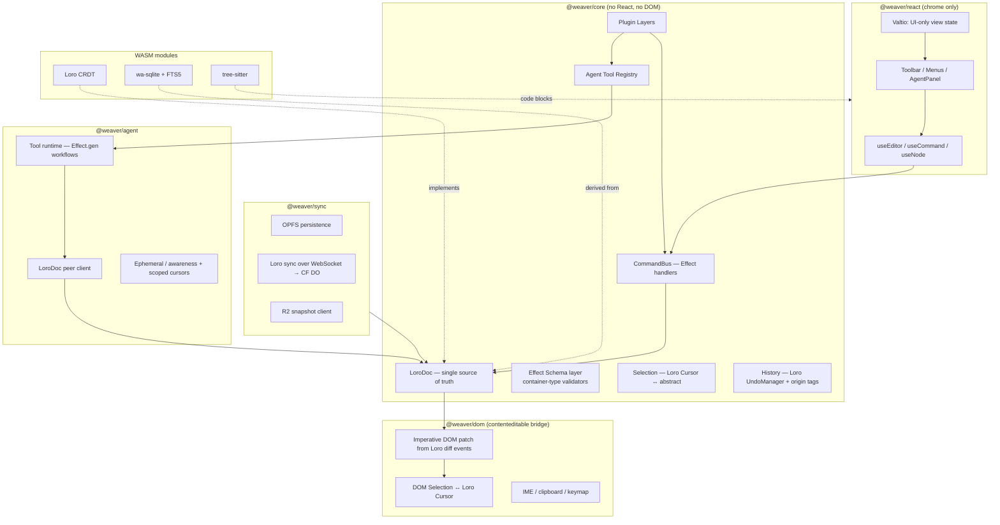
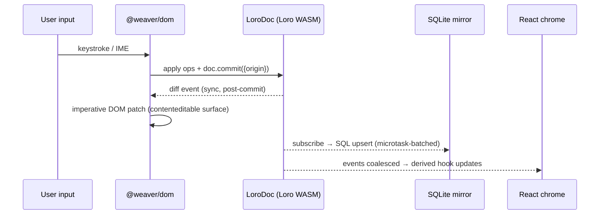
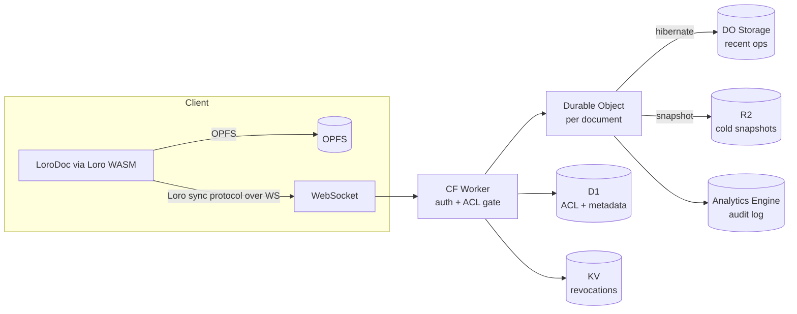
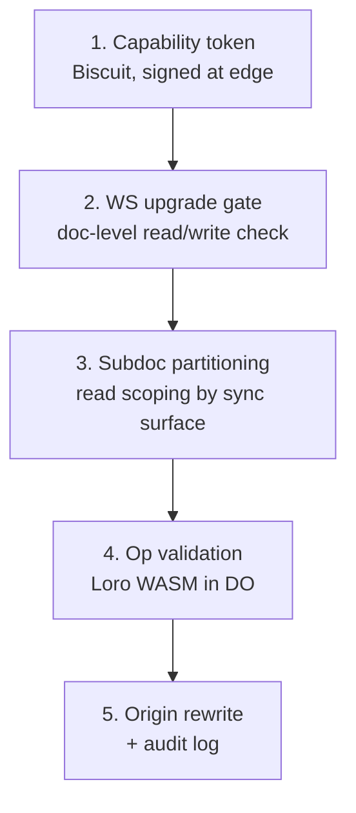

# weaver — System Architecture

> Companion to [`prd.md`](prd.md). For the deeper drill-downs see [`hard-problems.md`](hard-problems.md), [`wasm-strategy.md`](wasm-strategy.md), [`ai-agent.md`](ai-agent.md), and [`access-control.md`](access-control.md).

## 1. System overview



### Package layout

- `@weaver/core` — LoroDoc + schema + commands + selection + plugin contract. No DOM, no React.
- `@weaver/dom` — contenteditable bridge: imperative DOM patches from Loro diff events; DOM Selection ↔ Loro Cursor; IME / clipboard / keymap.
- `@weaver/react` — React adapters: hooks, chrome components.
- `@weaver/sync` — OPFS persistence; Loro sync protocol over WebSocket; R2 snapshot client.
- `@weaver/agent` — agent peer runtime, tool registry, ephemeral presence.
- `@weaver/server` — Cloudflare Worker + Durable Object + D1 schema for access control.
- `@weaver/wasm` — Loro wrapper; wa-sqlite wrapper; tree-sitter loader.
- `@weaver/plugins-*` — first-party plugins (paragraph, heading, list, code, table, link, image, suggestion, comments).

## 2. Document model — LoroDoc as single source of truth

### Why LoroDoc only (not a parallel state model)

A "two-state" design keeps an editor-native document tree alongside a separate CRDT replica and syncs the two at every edit. Weaver instead makes the CRDT *be* the document. What we gain by collapsing the two:

| Concern | Two-state (editor tree + CRDT replica) | LoroDoc-native (this design) |
|---|---|---|
| Source-of-truth ambiguity | Two states, sync layer between them, divergence bugs possible | One state. |
| History | Editor-layer undo stack, independent of the CRDT | Loro's peer-scoped `UndoManager` filters by origin natively. |
| Time travel / branching | Has to be built on top | First-class in Loro (`checkout`, `fork`, named snapshots). |
| Rich-text formatting | Inline attributes; concurrent-merge edge cases depend on the impl | Loro's `mark/unmark` is a CRDT primitive with defined concurrent semantics. |
| Multi-peer (incl. agent) | Both states must be kept in sync per peer | Native; one state, one set of ops. |
| Schema enforcement | Often strong in the editor-layer tree | Loose at the CRDT layer; we add a runtime check via Effect Schema. |
| Perf on huge docs | Editor-layer tree is in-memory and cheap; CRDT layer is the constraint | Loro's perf headroom is the relevant figure (see ADR 0001). |

For a side-by-side against named editors, see [`comparison.md`](comparison.md).

### Container layout (Notion-style block model — see [ADR 0002](adr/0002-notion-style-block-model.md))

Map document structure to Loro container types. Every block is a typed `LoroTreeNode`.

| Editor concept | Loro container |
|---|---|
| Document root | `LoroDoc` |
| Block tree (paragraphs, headings, lists, callouts, code, image, table, …) | `LoroTree` (`doc.getTree("content")`) — each tree node is one block |
| Block `kind` (`paragraph`, `heading`, `code`, `callout`, `table-row`, …) | `LoroMap` attr on the tree node (`kind: string`) |
| Block typed attributes (`heading.level`, `to-do.checked`, `image.src`, …) | `LoroMap` attrs on the tree node, validated by per-kind Effect Schema |
| Inline content inside a text-bearing block | `LoroText` referenced from the tree node (with `mark()` for marks) |
| Nested blocks (lists, toggles, callouts) | Child `LoroTreeNode`s under the parent |
| Comments | sibling `LoroTree` on the same subdoc; entries anchored via stable `Cursor` |
| Suggestions | per-author forked `LoroDoc` (Loro `fork()`) |
| Graveyard (concurrent delete-vs-edit conflicts) | sibling `LoroTree` ("graveyard") — see [ADR 0003](adr/0003-concurrent-semantics-no-global-rw-aw.md) |
| Selection state (canonical) | `LoroMap` ("selection") holding `Cursor` anchors per peer |
| Per-block ACL tag | `LoroMap` attr on the tree node (`acl-tag: "public" \| "internal" \| "confidential"`) |

The block-kind list shipped in v1 is in [`block-model.md` §3](block-model.md).

### Costs we accept

- **Loose schema by default.** Mitigated by an Effect Schema validator at every read/write boundary.
- **Non-natural CRDT ops.** "Uppercase selection" depends on what's there now; in concurrent contexts, define semantics explicitly (apply locally as a transform on the snapshot at apply time).
- **Loro is younger than Y.js.** Corner-case bugs more likely; mitigated by property tests and a thin adapter that contains the Loro surface (see [ADR 0001](adr/0001-adopt-loro-over-yjs.md) §"What we lose").
- **Selection is harder than in a tree-state editor.** See [`hard-problems.md` §1](hard-problems.md).

### Schema discipline

Every node type:

```ts
import { Schema } from "effect";
import { LoroTree, LoroTreeNode } from "loro-crdt";

const HeadingAttrs = Schema.Struct({
  level: Schema.Literal(1, 2, 3, 4, 5, 6),
  id: Schema.optional(Schema.String),
  acl: Schema.Literal("public", "internal", "confidential"),
});

class HeadingNode extends Schema.Class<HeadingNode>("HeadingNode")({
  node: Schema.instanceOf(LoroTreeNode),
  attrs: HeadingAttrs,
}) { /* typed mutators that go through doc.commit() boundaries */ }
```

Reads validate at the boundary; writes only commit via typed mutators, framed by `doc.commit({ origin })` so diff events carry the origin tag.

## 3. Reactivity & state

### The layering rule

| State kind | Owner | Reactivity source |
|---|---|---|
| Document content | LoroDoc | `doc.subscribe()` → diff events |
| Document derived (outline, FTS) | wa-sqlite mirror | SQL `subscribe` |
| Selection (canonical) | `Cursor` anchors in a `LoroMap` | Loro subscribe |
| Selection (DOM) | Browser `Selection` API | DOM events |
| UI ephemeral (toolbar open, AI panel) | Valtio | Proxy tracking |
| Presence / awareness | Loro `EphemeralStore` | Ephemeral subscribe |

**Hard rule:** Valtio never holds document data. If it's persisted or synced, it's in LoroDoc.

For the full treatment of how blocks live across these layers — Loro container shape, typed `Block<K>` selectors, React hook API, Valtio scope shape, and the worked examples that separate document state from per-viewer UI state — see [`block-model.md`](block-model.md).

### Render pipeline



Loro diff events fire **once per commit** by design (batched), not per individual op — an ergonomic win over Y.js `observeDeep`. Downstream React renders are still batched to one per microtask when multiple commits happen in a tick.

## 4. Effect-TS — where it shines, where it doesn't

### Use it for

| Concern | Why Effect helps |
|---|---|
| Command bus | Tagged commands + typed errors + cancellation; `Match.exhaustive` for handler dispatch |
| Plugin lifecycle | `Layer` composition is genuinely better than callback registration |
| AI agent workflows | Tool calls as Effects, streaming via `Stream`, cancellation, retry/backoff via `Schedule` |
| Sync orchestration | Reconnect, backoff, conflict observation, offline queueing |
| Persistence | OPFS + R2 snapshot policies as composable layers |
| Telemetry | Spans across user → LoroDoc → WS → peer |

### Don't use it for

- **Loro `subscribe` callbacks on the hot path.** They fire post-commit, often many per tick. Wrap → unwrap → schedule → run is overhead with no benefit.
- **Per-keystroke render scheduling.** React's commit phase doesn't compose with the Effect runtime.
- **The contenteditable DOM bridge.** Intrinsically imperative; pretending otherwise is ceremony.

> **Mental model:** Effect-TS is the conductor; the editor core is the orchestra. Musicians play imperatively in real time; the conductor coordinates entrances, dynamics, recovery.

## 5. Plugin architecture

Plugin = a Layer in Effect-TS terms, providing a subset of:

```ts
type Plugin = {
  blockKinds:           // Notion-style block kinds: schema + render + commands (ADR 0002)
  marks:                // Inline marks: schema + render + keymap + concurrent constraints
  commands:             // Effect-typed handlers (input schema, errors, output)
  transforms:           // Loro subscribe reactions (autoformat, link detection, …)
  render:               // React components for block / mark / decorations
  agentTools:           // Tool definitions exposed to the AI agent
  keymap:               // Key bindings → command refs
  concurrentSemantics:  // Per-op-kind: defer-to-loro | LWW | resolution-visibility | custom (ADR 0003)
};
```

`Layer.merge` to compose. Each plugin's Layer requires editor services (`EditorCore`, `LoroDoc`, `CommandBus`, `AgentRegistry`) and provides its own registrations.

**Built-in block kinds + marks are *not* plugins** — they live in `@weaver/core` (see [`block-model.md` §3](block-model.md)). Plugins **extend** the set with additional kinds (e.g. `math-equation`, `mermaid-diagram`, `kanban-card`) but cannot remove built-ins (would break content portability).

### Costs

- Plugin authors must learn Effect-TS and Loro's container model — smaller addressable contributor pool than callback-based Lexical plugins.
- Plugin authors must declare `concurrentSemantics` for every op kind — more rigor up front, fewer surprises in production.
- Mitigation: codegen / templates; a "plain TS" escape hatch for trivial plugins; the Loro adapter in `@weaver/core` hides the raw Loro surface.

## 6. Sync architecture

> Implementation-level detail (D1 schemas, DO state machine, op-validation protocol, audit log) lives in [`access-control.md`](access-control.md). This section is the architectural summary.

### Topology



- **DO per doc:** canonical LoroDoc in memory, relays validated updates, persists deltas to DO storage.
- **WebSocket hibernation:** DO can sleep with WS connections alive — low-traffic cost stays near zero.
- **R2 for snapshots:** periodic `export({ mode: "snapshot" })` full-state snapshots (with GC); DO storage truncated. On reconnect after long absence, snapshot + recent ops streamed to client.
- **D1 for ACL.** **KV for revocations** (eventually consistent ≤60 s).

### The five access-control primitives (summary)



Full treatment in [`access-control.md`](access-control.md).

## 7. Tradeoffs

| Tradeoff | We chose | Cost | Mitigation |
|---|---|---|---|
| Single source of truth | LoroDoc only | Loose schema; CRDT perf concerns at extreme scale | Effect Schema layer; Loro raises the ceiling; subdoc partitioning |
| Effect-TS everywhere vs. boundaries | Boundaries only | Some inconsistency in style across layers | Hot path documented as "imperative on purpose" |
| Valtio for everything vs. UI-only | UI-only | Some duplication for derived UI state | OK — UI state is genuinely separate |
| React-managed surface vs. imperative DOM | Imperative | More plumbing | Same pattern as every serious editor |
| Y.js (mature ecosystem) vs. Loro (better model, less ecosystem) | **Loro** ([ADR 0001](adr/0001-adopt-loro-over-yjs.md)) | Smaller community; can't reuse y-websocket / y-indexeddb; younger codebase | Thin adapter contains the Loro surface; property tests; sync transport was bespoke regardless |
| Op-level read filtering vs. subdoc partitioning | Subdoc partitioning | Cross-subdoc references need design | Container ID placeholders |
| UI-only access control vs. server op validation | Server op validation | 4–6 w of build + rollback complexity | Required if threat model includes malicious users |
| Feature parity vs. focused subset | 70–80% load-bearing subset | Some Lexical migrators see gaps | Plugins fill in |
| E2E encryption vs. server enforcement | Server enforcement | Trust the operator | Document explicitly; revisit if a market requires |
| Whiteboard / DB scope vs. docs-only | Docs-only ([ADR 0002](adr/0002-notion-style-block-model.md)) | Won't match BlockSuite/AFFiNE on breadth | Our differentiation is depth (AI-as-peer, audit ACL, headless), not breadth |

## See also

- [`prd.md`](prd.md) — product vision, scope, roadmap, decisions index
- [`hard-problems.md`](hard-problems.md) — the unsolved/hardest implementation problems
- [`wasm-strategy.md`](wasm-strategy.md) — WASM uses
- [`ai-agent.md`](ai-agent.md) — agent peer model in depth
- [`access-control.md`](access-control.md) — access-control implementation spec
- [`comparison.md`](comparison.md) — weaver vs other editors
- [`adr/`](adr/) — individual decision records
