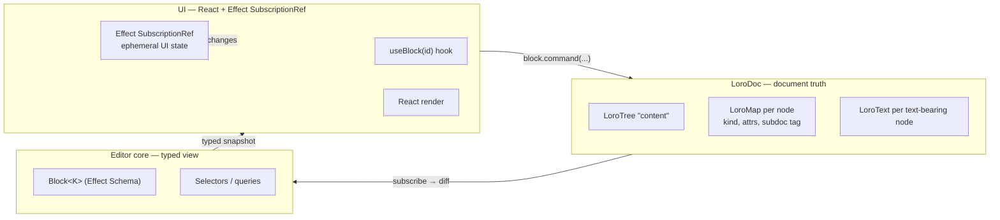
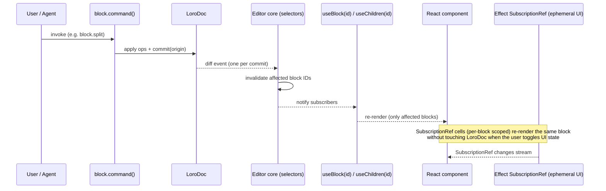

# Block Model — Data Structure, Reactivity, and UI State

> Companion to [`architecture.md` §2 and §3](architecture.md). Where the decision to use a Notion-style block model lives in [ADR 0002](adr/0002-notion-style-block-model.md), this doc fills in the implementation: how a block is stored, how it's mutated, how it reaches the screen, and how ephemeral UI state lives in Effect-TS `SubscriptionRef` stores alongside LoroDoc ([ADR 0006](adr/0006-ui-state-effect-over-valtio.md)).

## 1. The three layers

Every block in weaver exists at three layers. Each layer has one job; data flows in one direction across them.



| Layer | Owns | Reactivity | What lives here |
|---|---|---|---|
| **LoroDoc** | Document truth | `doc.subscribe()` diff events | Block tree structure, block `kind` and typed attrs, inline text + marks, per-block ACL tag, references between blocks. |
| **Editor core** | Typed view over LoroDoc | Pure derivation (no own state) | `Block<K>` selectors that decode `LoroTreeNode` + `LoroMap` into validated typed records. Stateless. |
| **UI (React + Effect)** | Rendering + ephemeral interaction | React hooks for document state; Effect-TS `SubscriptionRef` cells for ephemeral UI state | Toggle open/closed, hover/focus, drag preview, slash-menu state, toolbar open, AI panel state, in-flight selection rectangle. **Nothing that survives reload.** |

The hard rule: **anything that could be persisted, synced, or audited belongs in LoroDoc. Everything else — and only everything else — can live in a `SubscriptionRef`** ([ADR 0006](adr/0006-ui-state-effect-over-valtio.md)).

## 2. The block, in detail

### Anatomy

Every block has:

- **A stable ID** — the underlying `LoroTreeNode` ID. Persists across moves, edits, and re-parenting. This is the only ID that ever appears in URLs, comments, audit logs, or capability tokens.
- **A typed `kind`** — `paragraph`, `heading`, `list-item`, `code`, `quote`, `callout`, `divider`, `image`, `embed`, plus plugin-registered kinds. (Mentions are an inline *mark*, not a block kind — see [`mentions.md`](mentions.md).)
- **Typed attributes** validated by Effect Schema (per-kind shape). Schema is registered with the block-kind plugin; the editor refuses to apply ops that violate it on the client.
- **An optional inline content container** — `LoroText` for text-bearing kinds; absent for atomic blocks like `divider` or `image`.
- **Children** — recursive, via `LoroTree` parent/child edges. Lists, toggles, callouts, table rows all nest this way.

### Mapping to Loro containers

| Editor concept | Loro container | Notes |
|---|---|---|
| Document root | `LoroDoc` | One per logical doc; subdocs partition tiers per [`access-control.md` §5](access-control.md). |
| Block tree | `LoroTree` at path `content` | Each tree node is one block; structure ops (move, indent, outdent) are tree ops. |
| Block `kind` and attrs | `LoroMap` on the tree node | `{ kind: "callout", icon: "💡", tone: "info" }`. |
| Inline content | `LoroText` on the tree node | Only for text-bearing kinds. Marks live as Loro `mark/unmark` ops on this text. |
| Block-level ACL tag | `subdoc: string` attr on the tree node | Read by the sync layer to route into the right subdoc. |

Structural operations (insert, delete, move, indent, outdent) are native `LoroTree` ops with their CRDT semantics defined by Loro — not editor-layer transforms that have to be reconciled across peers.

### The typed view (`Block<K>`)

The editor core exposes a typed view over a `LoroTreeNode`:

```ts
// @weaver/core/block.ts
import { Schema } from "effect";

export const ParagraphAttrs = Schema.Struct({ /* no extras */ });
export const HeadingAttrs   = Schema.Struct({ level: Schema.Literal(1, 2, 3) });
export const CalloutAttrs   = Schema.Struct({
  icon: Schema.String,
  tone: Schema.Literal("info", "warn", "danger", "note"),
});

export type Block<K extends BlockKind = BlockKind> = {
  readonly id: BlockId;          // ULID derived from LoroTreeNode ID
  readonly kind: K;
  readonly attrs: AttrsFor<K>;   // typed by kind via the schema registry
  readonly hasInline: boolean;
  readonly childIds: ReadonlyArray<BlockId>;
  readonly subdoc: SubdocTag;
};
```

`Block<K>` is a **read-only snapshot**. It's derived from LoroDoc on demand; the editor never holds a mutable copy. Writes go through `block.command(...)` (§3), never by mutating a `Block` value.

## 3. Block-level operations

These are the only structural commands plugins compose against. Plugins don't reach into `LoroTree` directly — they call these.

| Command | What it does | CRDT primitive |
|---|---|---|
| `block.insert(parentId, index, kind, attrs)` | Create a new block of `kind` under `parentId` at `index`. | `tree.create` + `map.set` |
| `block.transform(blockId, newKind, attrs)` | Change a block's kind in place (e.g. paragraph → heading). Preserves children and inline content when compatible. | `map.set` on the node |
| `block.move(blockId, newParentId, newIndex)` | Move within or across parents. | `tree.move` |
| `block.indent(blockId)` / `block.outdent(blockId)` | Sugar over `tree.move` against siblings. | `tree.move` |
| `block.delete(blockId)` | Tombstone the node; children follow. | `tree.delete` |
| `block.split(blockId, offset)` | Split a text-bearing block at `offset` into two siblings of the same kind. | `text.delete` on tail of A + `tree.create` of B + `text.insert` |
| `block.merge(prevId, nextId)` | Inverse of split; append `next`'s text into `prev`, delete `next`. | `text.insert` + `tree.delete` |

Every command runs inside a single Loro transaction with `origin` set to the calling subject (user / agent / service). One commit → one diff event → one render pass downstream.

### Block kinds shipped in v1

| Kind | Children allowed | Inline content | Notes |
|---|---|---|---|
| `paragraph` | No | Yes | Default block; markdown shortcut to other kinds. |
| `heading` | No | Yes | Levels 1–3 (1–6 supported in schema; UI defaults to 3). |
| `bullet-list-item` | Yes (recursive list items) | Yes | Nesting → indent depth in UI. |
| `numbered-list-item` | Yes | Yes | Auto-renumber on reorder. |
| `to-do` | Yes | Yes | `checked: boolean` attr. |
| `toggle` | Yes | Yes | `collapsed: boolean` attr (document-shared collapsed; per-viewer override lives in `BlockUiStore` — see §6). |
| `quote` | Yes | Yes | Single-level only. |
| `callout` | Yes | Yes | `icon: emoji`, `tone: info\|warn\|danger\|note`. |
| `code` | No | Yes (plain) | `language: string`; tree-sitter highlighting. |
| `image` | No | No | `src`, `alt`, `width`, `height`; OPFS cache + R2. |
| `embed` | No | No | `url`, with allowlisted providers; iframe sandbox. |
| `divider` | No | No | Atomic. |
| `table` | Yes (`table-row` → `table-cell`) | No (cells have inline) | Block-table (not a Database); fixed columns. |

Plugins can register additional block kinds. They cannot remove these built-ins (would break content portability).

### Marks shipped in v1

| Mark | Constraints |
|---|---|
| `bold`, `italic`, `underline`, `strike` | Free overlap. |
| `code` | Inline code; cannot overlap `link`. |
| `link` | `href`; cannot overlap `code`; cannot nest. |
| `highlight` | `color: enum`. |
| `comment-anchor` | Internal; anchors a comment thread; not exposed to formatting UI. |
| `agent-pending` | Internal; "uncommitted agent edit" visualization. |
| `mention` | `{ userId, label, kind? }` referencing a principal (user/agent); `expand: "none"` — atomic, typing at either edge never extends it; applying it emits `MentionCreated`. Full UX + event contract in [`mentions.md`](mentions.md). |

Plugins can register additional marks with constraint declarations enforced at op-validation time.

## 4. How plugins extend blocks

A plugin registers one or more **block kinds** and/or **marks**. A block-kind registration declares:

- The `kind` string (must be globally unique; namespaced for non-core plugins: `myorg.timeline-event`).
- The Effect Schema for its typed attrs.
- Whether children are allowed; if so, which kinds are allowed as children.
- Whether inline content is allowed (and which marks are valid inside it).
- A `concurrentSemantics` declaration per [ADR 0003](adr/0003-concurrent-semantics-no-global-rw-aw.md) — what to do when two peers concurrently edit the same block.
- A render adapter (currently React; the renderer is an interface so a non-React adapter can ship later — see [`architecture.md` §3](architecture.md#3-reactivity--state)).
- Optional commands the plugin contributes (e.g. `code.toggleLineNumbers`).

Plugins **cannot** register top-level surface modes — no plugin can ship a whiteboard or a Database view inside weaver v1. They extend the block-kind catalog; they don't change the editor's modality.

## 5. Reactivity — from LoroDoc to React

### Subscription topology



Loro diff events fire **once per commit**, not per individual op. The editor core walks the diff, computes the set of affected block IDs, and notifies only the React hooks subscribed to those IDs. Unaffected blocks don't re-render.

### Hooks (React API)

```ts
// @weaver/react
useBlock(id: BlockId): Block<K> | undefined
useChildren(parentId: BlockId): ReadonlyArray<BlockId>
useInlineText(id: BlockId): LoroText | undefined  // for text-bearing kinds
useBlockMarks(id: BlockId): ReadonlyArray<Mark>
```

Each hook subscribes to **exactly the slice of LoroDoc it depends on**. A React component that renders one block calls `useBlock(id)` and `useChildren(id)`; mounting 1000 blocks creates 2000 narrow subscriptions, each invalidated only by ops that touch that block.

### The render adapter

The editor surface (contenteditable area) is **not React-managed** — it's imperatively patched by `@weaver/dom` from Loro diff events ([`architecture.md` §1](architecture.md#1-system-overview)). React is used only for **chrome** around the editor: block-handle UI, toolbar, slash menu, comments panel, AI panel. Those parts subscribe to LoroDoc the normal way (via hooks above) and to Effect-TS `SubscriptionRef` stores for their own ephemeral state (§6).

## 6. Ephemeral UI state — Effect-TS `SubscriptionRef`

Per [ADR 0006](adr/0006-ui-state-effect-over-valtio.md), all ephemeral UI state lives in Effect-TS — `SubscriptionRef<T>` for observable cells, `PubSub<E>` for event broadcasts, `Layer` for store composition and injection, `Match.tag` (with `Schema.TaggedStruct` / `Schema.Union`) for state machines. It is the only place such state lives.

"Ephemeral UI state" means state that is reset on reload, never travels over the network, and is purely a function of how this one viewer is currently interacting with the UI.

### Allowed in `SubscriptionRef` stores

| State | Scope | Example |
|---|---|---|
| Toggle open/closed | Per-block, per-viewer | A `toggle` block's expanded/collapsed state in the local UI. (`collapsed` in the block's typed attrs is **document-shared collapsed**, which is a different attribute — see "Two collapse states" below.) |
| Hover / focus ring | Per-block, per-viewer | Highlighting the block under the cursor for the drag handle. |
| Drag preview | Editor-wide, ephemeral | The floating block preview while a drag is in flight. |
| Slash-menu state | Editor-wide | A `Closed \| Open { anchor, filter, highlight }` tagged union. |
| Floating toolbar state | Editor-wide | Position, currently-applicable marks, open submenus. |
| AI panel state | Editor-wide | Open/closed, conversation scroll position, draft input. |
| In-flight selection rectangle | Editor-wide | Marquee-select preview before commit to `Cursor`. |
| Per-block UI flags | Per-block | "Comments thread is expanded for this block in this tab." |

### Forbidden in `SubscriptionRef` stores

| State | Where it really belongs |
|---|---|
| Block content (inline text, marks) | LoroDoc — document data; must sync, audit, undo, branch. |
| Block kind, attrs, children | LoroDoc — document data. |
| Per-block ACL tag (`subdoc`) | LoroDoc — load-bearing for access control. |
| Comment threads, comment bodies | LoroDoc — document data. |
| Selection canonical state (cursor anchors that should survive reload or follow a presence broadcast) | `Cursor` anchors in a `LoroMap`. |
| Presence (where another peer's cursor is) | Loro `EphemeralStore`. |
| Server-derived authorization state (what the user can edit) | The capability token; not a UI concern past initial bootstrap. |

The hard rule: **anything that could be persisted, synced, or audited belongs in LoroDoc. Everything else — and only everything else — can live in a `SubscriptionRef`.**

### The shape of an Effect-TS store

UI state is organized as **services** — a small set of editor-wide `SubscriptionRef`s on an `EditorUiStore`, plus per-block cells lazily allocated on a `BlockUiStore`.

```ts
// @weaver/react/state/editor-ui.ts
import { Effect, Layer, SubscriptionRef, Ref, Schema, Match } from "effect";

export const SlashMenu = Schema.Union(
  Schema.TaggedStruct("Closed", {}),
  Schema.TaggedStruct("Open", {
    anchor: BlockIdSchema,
    filter: Schema.String,
    highlight: Schema.Number,
  }),
);
export type SlashMenu = Schema.Schema.Type<typeof SlashMenu>;

export class EditorUiStore extends Effect.Service<EditorUiStore>()(
  "EditorUiStore",
  {
    effect: Effect.gen(function* () {
      const slashMenu = yield* SubscriptionRef.make<SlashMenu>({ _tag: "Closed" });
      const toolbar   = yield* SubscriptionRef.make<ToolbarState>(initialToolbar);
      const aiPanel   = yield* SubscriptionRef.make<AiPanelState>(initialAi);
      const drag      = yield* SubscriptionRef.make<DragState>({ _tag: "Idle" });
      return { slashMenu, toolbar, aiPanel, drag };
    }),
  },
) {}

// Per-block ephemera, lazily allocated.
export interface BlockUi {
  readonly hovered: boolean;
  readonly handleVisible: boolean;
  readonly threadExpanded: boolean;
  readonly locallyCollapsed: boolean | null;  // toggle/list local-collapse override
}
const initialBlockUi: BlockUi = {
  hovered: false, handleVisible: false, threadExpanded: false, locallyCollapsed: null,
};

export class BlockUiStore extends Effect.Service<BlockUiStore>()(
  "BlockUiStore",
  {
    effect: Effect.gen(function* () {
      const cells = new Map<BlockId, SubscriptionRef.SubscriptionRef<BlockUi>>();
      const cellFor = (id: BlockId) =>
        Effect.sync(() => {
          let c = cells.get(id);
          if (!c) {
            c = Effect.runSync(SubscriptionRef.make<BlockUi>(initialBlockUi));
            cells.set(id, c);
          }
          return c;
        });
      const dispose = (id: BlockId) =>
        Effect.sync(() => { cells.delete(id); });
      return { cellFor, dispose };
    }),
  },
) {}
```

State transitions are exhaustive tagged-union pattern matches, not field assignments:

```ts
const openSlashMenu = (anchor: BlockId) =>
  Effect.gen(function* () {
    const { slashMenu } = yield* EditorUiStore;
    yield* Ref.set(slashMenu, { _tag: "Open", anchor, filter: "", highlight: 0 });
  });

const handleSlashKey = (ev: KeyboardEvent) =>
  Effect.gen(function* () {
    const { slashMenu } = yield* EditorUiStore;
    const current = yield* Ref.get(slashMenu);
    yield* Match.value(current).pipe(
      Match.tag("Closed", () => Effect.unit),
      Match.tag("Open", () =>
        Match.value(ev.key).pipe(
          Match.when("Escape", () =>
            Ref.set(slashMenu, { _tag: "Closed" }),
          ),
          Match.when("ArrowDown", () =>
            Ref.update(slashMenu, (s) =>
              s._tag === "Open" ? { ...s, highlight: s.highlight + 1 } : s,
            ),
          ),
          Match.orElse(() => Effect.unit),
        ),
      ),
      Match.exhaustive,
    );
  });
```

### React adapter

One hook bridges Effect's `Stream` to React's `useSyncExternalStore`:

```ts
// @weaver/react/use-subscription-ref.ts
import { useCallback, useSyncExternalStore } from "react";
import { Effect, Fiber, Ref, Stream, SubscriptionRef } from "effect";

export function useSubscriptionRef<T, S>(
  ref: SubscriptionRef.SubscriptionRef<T>,
  select: (t: T) => S,
  eq: (a: S, b: S) => boolean = Object.is,
): S {
  return useSyncExternalStore(
    useCallback((onChange) => {
      const fiber = Effect.runFork(
        ref.changes.pipe(
          Stream.map(select),
          Stream.changesWith(eq),
          Stream.runForEach(() => Effect.sync(onChange)),
        ),
      );
      return () => { Effect.runFork(Fiber.interrupt(fiber)); };
    }, [ref, select, eq]),
    () => select(Effect.runSync(Ref.get(ref))),
  );
}
```

A React component reads both LoroDoc (via the block hooks) and the UI store (via `useSubscriptionRef`):

```tsx
const BlockChrome: React.FC<{ id: BlockId }> = ({ id }) => {
  const block = useBlock(id);                            // LoroDoc-derived
  const ui    = useBlockUi(id);                          // SubscriptionRef-derived
  if (!block) return null;
  const onEnter = () => updateBlockUi(id, (s) => ({ ...s, hovered: true }));
  const onLeave = () => updateBlockUi(id, (s) => ({ ...s, hovered: false }));
  return (
    <div
      data-block-id={id}
      data-kind={block.kind}
      onMouseEnter={onEnter}
      onMouseLeave={onLeave}
    >
      {ui.handleVisible && <BlockHandle id={id} />}
      <BlockBody block={block} />
    </div>
  );
};
```

`useBlockUi(id)` and `updateBlockUi(id, fn)` are thin helpers over `BlockUiStore.cellFor(id)`. The store is provided via a `Layer` at the React root so tests and Storybook stories can swap implementations.

When the user types into the block, the contenteditable surface goes to LoroDoc directly via `@weaver/dom` — it never goes through the UI store.

### Two collapse states (worked example of the layering rule)

A `toggle` block can be collapsed in two distinct senses, and they go in two different layers:

| Sense | Layer | Why |
|---|---|---|
| **"This document has the toggle collapsed for everyone, as part of its content."** | LoroDoc (`collapsed: boolean` typed attr) | A document author intentionally publishes a collapsed toggle; this should sync, be auditable, and survive reload. It's part of the doc. |
| **"I, the current viewer, have temporarily expanded this toggle in my tab."** | `BlockUiStore.cellFor(id).locallyCollapsed` | A per-viewer override of the document state. Does not sync. Does not persist. Resets on reload. |

The component reads the LoroDoc value and overlays the local override:

```tsx
const visuallyCollapsed = ui.locallyCollapsed ?? block.attrs.collapsed;
```

This is the **shape every "two collapse states" question takes**: if it should sync, it's LoroDoc; if it's "my local view of the doc," it's the UI store.

## 7. Why blocks are the right unit for the AI agent

The agent (see [`ai-agent.md`](ai-agent.md)) operates on stable, addressable units. A block:

- Has an ID the agent can reference across turns (`block:01H7…`) without worrying about cursor drift.
- Has a typed `kind` the agent can reason about ("this is a heading; suggest sub-blocks").
- Maps cleanly to the agent's tool surface: `rewrite-block(blockId, instruction)`, `transform-block(blockId, newKind)`, `generate-children(blockId, prompt)`.
- Carries its own ACL tag, so the capability check at the tool boundary is one lookup against `block.subdoc`.

Block-level concurrent semantics ([ADR 0003](adr/0003-concurrent-semantics-no-global-rw-aw.md)) mean the agent and a human can edit the same block without coordinating — Loro merges, and `origin: agent-N` survives into the audit log.

The agent peer does **not** touch the UI store. The UI store is a viewer-only concern; the agent's view of the doc is the LoroDoc state machine.

## 8. Anti-patterns to reject

- **Mirroring LoroDoc into a `SubscriptionRef`.** "Let me keep an Effect store in sync with the block tree for easier React access" — no. Use the typed selectors and hooks; LoroDoc already supports narrow subscriptions. See [ADR 0006 §"What this changes"](adr/0006-ui-state-effect-over-valtio.md) for the full argument.
- **Putting comment bodies / inline text in the UI store.** Comment bodies are document data; they belong in LoroDoc. *Local draft text* in the comment composer (not yet submitted) can live in the UI store.
- **Holding a mutable `Block` value and editing it.** `Block<K>` is a read-only snapshot. Mutations go through `block.command(...)`.
- **Using `useState` for cross-component editor state.** Component-local `useState` is fine for genuinely local UI concerns. If two components need to read or write it, hoist it to a `SubscriptionRef` on `EditorUiStore`, not React Context.
- **Subscribing to all of LoroDoc.** Use the narrow `useBlock(id)` / `useChildren(id)` hooks.
- **Hand-rolling Loro container access in components.** Components consume `Block<K>` and `LoroText` references through the hook API; they don't call `doc.getTree("content")` directly.
- **Untagged UI state.** A new menu/panel/modal starts as a `Schema.Union` tagged state, not as accreting boolean flags on a record. Future contributors should be able to add a case and have `Match.exhaustive` flag every site that hasn't handled it.
- **Reaching for Valtio / Zustand / Jotai.** None of those are in the stack — see [ADR 0006](adr/0006-ui-state-effect-over-valtio.md). If you need cross-component ephemeral state, use Effect.

## See also

- [`architecture.md` §2 (document model)](architecture.md#2-document-model--lorodoc-as-single-source-of-truth) — the source-of-truth axiom.
- [`architecture.md` §3 (reactivity & state)](architecture.md#3-reactivity--state) — the layering table.
- [ADR 0002 — Notion-style block model](adr/0002-notion-style-block-model.md) — the decision and scope rationale.
- [ADR 0003 — Concurrent semantics](adr/0003-concurrent-semantics-no-global-rw-aw.md) — per-block merge rules.
- [ADR 0006 — UI state store: Effect-TS over Valtio](adr/0006-ui-state-effect-over-valtio.md) — why ephemeral UI state lives in `SubscriptionRef`.
- [`ai-agent.md`](ai-agent.md) — how the agent peer reads and writes blocks.
- [`access-control.md` §5](access-control.md) — how the per-block `subdoc` tag drives tier routing.
