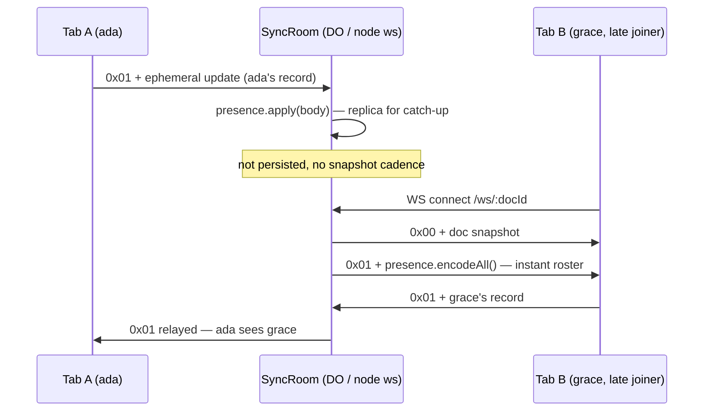

# Presence — Who Is In The Document

> Companion to [`architecture.md`](architecture.md) §6 (sync relay) and [`ai-agent.md`](ai-agent.md) §2.2 (agent presence cursors). Realizes the Phase 2b PRD deliverable "Loro `EphemeralStore` for presence/awareness" ([`prd.md`](prd.md) §Phase 2) for the human-collaborator case: Google-Docs / Notion-style live avatars and identity of everyone currently in a document.

## The split: mechanism in weaver, identity in the embedding app

Weaver owns the **mechanism**: publishing, relaying, and rendering presence records. The embedding app owns **identity**: who the current user is, their display name, avatar, and color — supplied as a `Principal` (`packages/core/src/principal.ts`), exactly as the mentions directory is app-supplied ([`mentions.md`](mentions.md)). Weaver never fetches, authenticates, or validates identity; per the trust model (ADR 0005), the relay serves a cooperative org — presence claims are attributed, not verified.

| Concern | Owner |
|---|---|
| Presence record store + wire relay | weaver (`@weaver/core` + `@weaver/sync*`) |
| Avatar / caret rendering | weaver (`@weaver/react` facepile, `@weaver/dom` overlay) — replaceable |
| Who the local user *is* (`Principal`) | embedding app |
| Authentication / room authorization | embedding app + Phase 2b Biscuit gate ([`access-control.md`](access-control.md)) |

## State layering

Presence is the canonical example of the ephemeral row in the state table ([`architecture.md`](architecture.md), [`block-model.md`](block-model.md) §6): it must **never** enter LoroDoc. It does not survive reload, does not appear in history or audit, and merges by timestamp last-write-wins per key — Loro's `EphemeralStore` semantics, not CRDT op semantics.

| Property | Value |
|---|---|
| Store | One Loro `EphemeralStore` per editor session (`createPresenceHub`, `packages/core/src/presence.ts`) |
| Key | `peerId` — unique **per session** (per tab), not per principal |
| Value | `PresenceRecord`: `peerId`, `principalId`, `label`, `color`, `kind`, `avatarUrl?`, `mode`, `cursor?` |
| Conflict rule | Timestamp LWW per key (built into `EphemeralStore`) |
| Eviction | Inactivity timeout + heartbeat (below) |

`peerId` is per-session so the same principal in two tabs yields two records that do not clobber each other's cursor; UI that shows *people* (the facepile) dedupes by `principalId`, UI that shows *carets* keys by `peerId`.

## Wire protocol

Phase 2a framed every WebSocket message as a bare Loro doc-update blob. Presence introduces the first second frame kind, so the wire format gains a **1-byte tag prefix** (`packages/sync-core/src/frame.ts`):

| Tag | Kind | Body | Relay behavior |
|---|---|---|---|
| `0x00` | `doc` | Loro update / snapshot blob (`doc.export`) | Import into canonical doc, relay to other peers, counts toward snapshot cadence |
| `0x01` | `presence` | `EphemeralStore` encoded update (`subscribeLocalUpdates` bytes / `encodeAll()`) | Apply into the room's presence replica, relay to other peers. **Never persisted**, never counts toward cadence |

Unknown tags and bodies that fail to decode are dropped (logged, not relayed, socket stays open) — same hygiene as malformed doc frames. The tag byte is deliberately the *outermost* layer so the Phase 2b per-tier filtered broadcast can route presence per-recipient without decoding Loro internals.



### Server-side replica

`SyncRoom` (`packages/sync-core/src/sync-room.ts`) keeps an `EphemeralStore` replica alongside the canonical `LoroDoc` for one purpose: a late joiner receives the current roster in a single `encodeAll()` frame at connect time, instead of waiting for every peer's next heartbeat. Applying inbound presence bytes also validates them before relay. The replica is memory-only; a Durable Object hibernation cycle loses it, and the heartbeat repopulates it — acceptable staleness for ephemeral state.

### Liveness: heartbeat + timeout, not connection tracking

The relay does **not** map connections to presence keys (that would require decoding ownership on the hot path). Ghost eviction is timestamp-based:

- Every client **re-publishes its own record on an interval** (`usePresence` heartbeat, default 15 s). A re-`set` refreshes the key's timestamp everywhere.
- Every store (client hubs and the server replica) runs the same **inactivity timeout** (wire default 45 s): a key not refreshed within the window is evicted and subscribers see the removal.
- Clean exits (`usePresence` unmount, `beforeunload`) best-effort `delete` the local key, which propagates as an ephemeral update — instant removal on the happy path, timeout as the backstop.

The in-tab Playground mock agents keep their long demo timeout (24 h, no heartbeat — an idle "done" agent must not vanish mid-demo); the timeout is a `createPresenceHub({ timeoutMs })` option, not a constant.

## API surface

```ts
// @weaver/core — mechanism
const hub = createPresenceHub({ timeoutMs: 45_000 });
hub.applyRemote(bytes);                  // inbound wire bytes → store
hub.subscribeLocalUpdates((bytes) => …); // local set/delete → outbound wire bytes
hub.encodeAll();                         // full roster (server catch-up)

// @weaver/sync — transport wiring (one new option)
initSync(editor.doc, { docId, wsUrl, presence: hub });

// @weaver/react — embedding-app ergonomics
const { peers } = usePresence(hub, { self: principal }); // publishes self + heartbeat
<PresenceFacepile hub={hub} maxFaces={5} className="…" /> // avatars, initials, +N overflow
```

`usePresence` builds the local `PresenceRecord` from the app-supplied `Principal` — the only point where identity crosses into the mechanism. Caret rendering reuses the existing `attachPresenceOverlay` (`packages/dom/src/presence-overlay.ts`) unchanged: any record carrying a non-null `cursor` draws a caret, whether it came from a mock agent in-tab or a human over the wire.

## Not in this phase (hook points reserved)

- **Tier / viewer-scope filtering** ([`prd.md`](prd.md) Phase 2b): the relay broadcasts presence room-wide. The frame tag keeps presence separable so the Biscuit-gated DO can later filter per-recipient without a wire change.
- **Cursor publishing for humans**: the record schema carries `cursor`, and remote carets render today, but the v1 client publishes avatar-level presence (`cursor: null`); mapping the local DOM selection into block/offset on `selectionchange` is follow-up work shared with Loro `Cursor` anchoring ([`hard-problems.md`](hard-problems.md) §1).
- **Presence authentication**: a malicious *authorized* peer can publish any label/avatar. Attribution, not verification (ADR 0005); the agent-threat-surface analysis applies unchanged.
- **Relay-side resource caps**: the relay applies inbound presence frames into its replica without bounding the number of presence keys or the frame size per connection. Today this is only loosely bounded by the 45 s eviction timeout; a Phase 2b hardening pass should cap key count and frame size per connection so one peer can't bloat a room's replica.
- **Playground `?ws=` origin allowlist**: the Playground accepts an arbitrary relay origin from the `?ws=` query param — fine for a local demo, but an allowlist (or explicit user confirmation before connecting to a foreign origin) belongs with the Phase 2b auth gate.

## Verification

- `packages/sync-core/tests/` — frame codec round-trip; doc/presence relay branching; late-joiner catch-up roster; malformed/unknown frames dropped; presence excluded from snapshot cadence.
- `packages/core/tests/presence.test.ts` — two-hub wire round-trip via `subscribeLocalUpdates` → `applyRemote`; delete propagation.
- `packages/sync/tests/sync.test.ts` — tagged outbound deltas; inbound demux to doc vs. hub.
- `apps/playground/tests/acceptance/presence.spec.ts` — two real browser contexts against a live `@weaver/server-node`: both facepiles show both identities; edits sync between tabs; closing a tab drops its avatar.

## Playground demo

`?ws=ws://127.0.0.1:8787&doc=<id>&me=user:ada` puts the Playground in collab mode: the `me` principal comes from the demo directory (`apps/playground/src/principals.ts`), the facepile renders in the surface header, and two tabs on the same `doc` see each other live. `pnpm --filter @weaver/playground dev:sync` runs the local relay.
