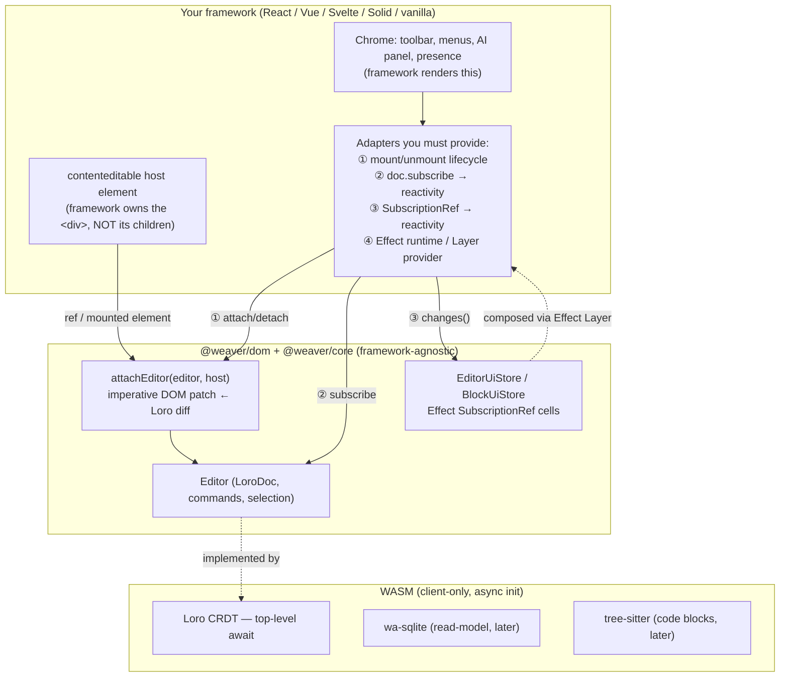

# weaver — UI Framework Compatibility

> Which UI frameworks integrate with weaver, and *why integration is not free*. The editor core is framework-agnostic by construction — but two architectural commitments, **WASM** (Loro, [ADR 0001](adr/0001-adopt-loro-over-yjs.md)) and **Effect-TS for UI state** ([ADR 0006](adr/0006-ui-state-effect-over-valtio.md)), each impose a concrete adapter cost on any framework that hosts the editor. Companion to [`architecture.md`](architecture.md) and [`wasm-strategy.md`](wasm-strategy.md).

## 1. TL;DR

- **The editing surface is framework-neutral.** `@weaver/core` (no DOM, no React) plus `@weaver/dom` (`attachEditor(editor, host)` — an imperative `contenteditable` bridge) is everything you need to mount a working editor into any element. React, Vue, Svelte, Solid, Angular, or vanilla DOM all reach the editor through that same boundary.
- **The framework's job is the *chrome*, not the *content*.** Toolbars, slash menus, the AI panel, presence cursors — that's what a framework renders. The block content inside the `contenteditable` host is patched imperatively from LoroDoc diffs; the framework's reconciler must *not* own that subtree.
- **Two things make a new framework adapter non-trivial:**
  1. **WASM** — Loro instantiates a WebAssembly module via **top-level await** at import. Every bundler and meta-framework must be configured for async WASM + TLA, and the editor is **client-only** (no SSR of the surface). This is a build-and-lifecycle tax, paid once per toolchain.
  2. **Effect-TS** — ephemeral UI state lives in `SubscriptionRef` cells driven by Effect `Stream`s. Bridging those into a framework's reactivity (and hosting the Effect runtime/`Layer` that owns them) is a per-framework adapter. React's adapter ships (`useSubscriptionRef` over `useSyncExternalStore`); other frameworks need their analog.

**Bottom line:** React is the only **first-class** target for v1. Every other framework is *portable* — the boundary is deliberately thin — but "portable" means "you write ~4 small adapters," not "it just works."

## 2. The integration boundary



The vertical split is the whole story: **everything below the line is framework-neutral and already written.** A framework integration is the box on top — and its size is set almost entirely by the two complexity sources in §3 and §4.

What React's adapter (`@weaver/react`) actually is, in full:

| Adapter | File | What it does |
|---|---|---|
| Lifecycle owner | [`use-editor.ts`](https://github.com/OpenHackersClub/weaver/blob/main/packages/react/src/use-editor.ts) | `createEditor()` once per component, `dispose()` on unmount. StrictMode-safe. |
| Host mount | [`editor-root.tsx`](https://github.com/OpenHackersClub/weaver/blob/main/packages/react/src/editor-root.tsx) | `useEffect` → `attachEditor(editor, el)` → `bridge.detach()` on cleanup. |
| Doc → reactivity | `use-editor.ts` (`useBlock`, `useChildren`) | `editor.doc.subscribe(...)` → `useState`, with structural-equality gates. |
| UI state → reactivity | [`use-subscription-ref.ts`](https://github.com/OpenHackersClub/weaver/blob/main/packages/react/src/use-subscription-ref.ts) | `Stream.changes` → `useSyncExternalStore`. |

Note there are **two** distinct reactive sources to bridge (rows 3 and 4) — see §4.1. That duality is intrinsic to the architecture, not a React quirk.

## 3. Complexity source #1 — WASM

Loro is a Rust CRDT compiled to WebAssembly ([ADR 0001](adr/0001-adopt-loro-over-yjs.md)). The performance is the point; the cost is that **WASM is not a normal JS dependency**, and that cost surfaces at exactly the framework/bundler boundary.

### 3.1 Loro initializes via top-level await

`loro-crdt` instantiates its `.wasm` module at import time using **top-level await**. The API is synchronous *after* the module has loaded (`new LoroDoc()` in [`@weaver/core`](https://github.com/OpenHackersClub/weaver/blob/main/packages/core/src/editor.ts) is a plain sync call), but the *import graph that reaches it is async*. Three consequences fall out, and the repo's own playground config proves all three:

```ts
// apps/playground/vite.config.ts — the minimum viable WASM setup
import wasm from "vite-plugin-wasm";
import topLevelAwait from "vite-plugin-top-level-await";

export default defineConfig({
  plugins: [react(), wasm(), topLevelAwait()], // ← WASM loader + TLA transform
  build: { target: "es2022" },                 // ← TLA needs es2022+
  optimizeDeps: { exclude: ["loro-crdt"] },    // ← keep esbuild from pre-bundling the WASM
});
```

1. **A WASM-aware loader plugin is mandatory.** The bundler has to emit and instantiate the `.wasm` asset.
2. **A top-level-await transform / `es2022`+ target is mandatory.** Older targets reject TLA outright.
3. **The dependency optimizer must skip Loro.** Vite's esbuild pre-bundle mangles the WASM init; `optimizeDeps.exclude` opts it out. Other bundlers have the analogous escape hatch.

### 3.2 Per-toolchain checklist

Every framework ships through a bundler, so "does framework X work" is really "is X's bundler configured for async WASM + TLA":

| Toolchain | What it needs |
|---|---|
| **Vite** (React, Vue, Svelte, Solid, vanilla) | `vite-plugin-wasm` + `vite-plugin-top-level-await`; `build.target: "es2022"`; `optimizeDeps.exclude: ["loro-crdt"]`. Proven in `apps/playground`. |
| **Next.js / webpack** | `config.experiments = { asyncWebAssembly: true, topLevelAwait: true }` in `next.config.js`; mark the editor entry `"use client"` and load it via `next/dynamic` with `ssr: false`. |
| **Nuxt / Vite** | Same Vite plugins; force the editor component client-only (`<ClientOnly>` / `.client.vue`). |
| **SvelteKit / Vite** | Same Vite plugins; gate mount on `browser` from `$app/environment`; never instantiate the editor during SSR. |
| **Astro** | `vite: { plugins: [wasm(), topLevelAwait()] }` in `astro.config`; island must be `client:only` (not `client:load`) so the surface never server-renders. |
| **esbuild / Parcel / Rollup direct** | A WASM plugin + TLA support; confirm the output format permits top-level await (ESM, not CJS). |

If a toolchain can't do TLA (legacy CJS targets, some edge runtimes), Loro can't load there — full stop. That is the hard floor of WASM compatibility.

### 3.3 The editor surface is client-only

WASM CRDT state and a `contenteditable` DOM both belong to the browser. The surface **cannot be server-rendered**:

- The framework may SSR the *chrome shell* (an empty toolbar, a loading skeleton) — but the editor host must mount in a client-only lifecycle (`useEffect`, `onMounted`, `onMount`, `client:only`). React's [`EditorRoot`](https://github.com/OpenHackersClub/weaver/blob/main/packages/react/src/editor-root.tsx) already does this: `attachEditor` runs inside `useEffect`, which never executes on the server.
- Hydration mismatch is a non-issue *only if* you keep the host's children out of the server-rendered HTML. Render an empty host on the server; let `attachEditor` fill it on the client.

### 3.4 WASM can't touch the DOM — so frameworks don't render block content

This is the subtlest gotcha and the reason weaver looks different from a "render your doc as JSX" editor. WASM has no DOM access ([`wasm-strategy.md` §3](wasm-strategy.md)); the bridge in [`@weaver/dom`](https://github.com/OpenHackersClub/weaver/blob/main/packages/dom/src/bridge.ts) patches the `contenteditable` subtree **imperatively** from Loro diff events. Therefore:

- **The framework must treat the editor host as an uncontrolled / un-reconciled region.** In React: render `<div ref={...} />` and never put children in it — if React's reconciler and the bridge both write the same nodes, they fight. Vue/Svelte/Solid: same rule — bind the element, leave its interior to `attachEditor`.
- The framework owns *around* the surface (chrome), not *inside* it. This is by design — the LoroDoc-as-single-source-of-truth rule ([`architecture.md` §2](architecture.md)) forbids a parallel framework-owned view of the content.

### 3.5 Multiple WASM modules compound the cost

v1 is Loro only, but [`wasm-strategy.md` §2](wasm-strategy.md) commits to **wa-sqlite** (client read-model) and **tree-sitter** (code blocks) as additional WASM modules. Each is another async-init dependency, another bundler asset, and more first-load payload to code-split. A framework adapter that's correct for one WASM module is structurally correct for all three — but the bundle-size and lazy-loading story grows with each.

## 4. Complexity source #2 — Effect-TS UI state

Ephemeral UI state (slash menu, toolbar, drag preview, per-block hover/focus) lives in Effect-TS `SubscriptionRef` cells, not in a framework store ([ADR 0006](adr/0006-ui-state-effect-over-valtio.md)). This is a deliberate "one mental model at the boundary" choice — but it means a framework can't reach UI state through its native store; it needs an adapter from Effect's reactive primitive into the framework's.

### 4.1 There are two reactive sources, not one

A framework adapter has to bridge **both** of these into framework-native reactivity:

| Source | Primitive | Carries |
|---|---|---|
| **Document content** | `editor.doc.subscribe(cb)` (Loro) | Blocks, text, marks — the LoroDoc tree. |
| **Ephemeral UI state** | `SubscriptionRef.changes` → Effect `Stream` (ADR 0006) | Menu open/closed, hover, toolbar, drag, AI-panel state machine. |

They are different mechanisms with different lifecycles. React handles them with two different hooks (`useBlock`/`useChildren` for the first; `useSubscriptionRef` for the second). Any new framework adapter reproduces *both*.

### 4.2 You need a managed Effect runtime, owned by the framework tree

`SubscriptionRef` cells live inside an `EditorUiStore` / `BlockUiStore` service composed via `Layer` (ADR 0006 §"Implementation sketch"). To use them, the framework must:

- **Host a long-lived Effect runtime.** Subscriptions are `Effect.runFork(stream...)`; synchronous reads are `Effect.runSync(Ref.get(ref))`. The runtime (and the provided `Layer`) has to outlive every component that reads a cell, and be torn down with the editor.
- **Expose the stores through the framework's DI.** React Context, Vue `provide`/`inject`, Svelte context, Solid's context — the store services ride the framework's own provider so that nested chrome components can `yield* EditorUiStore`.

This is the part people underestimate: it's not just "subscribe to a value," it's "stand up and own an Effect runtime inside the component tree."

### 4.3 The reactivity bridge differs per framework

React's adapter is `useSyncExternalStore`-shaped because that's React's official external-store contract:

```ts
// React — the shipped adapter (packages/react/src/use-subscription-ref.ts)
useSyncExternalStore(
  (onChange) => {
    const fiber = Effect.runFork(
      ref.changes.pipe(Stream.map(select), Stream.changesWith(eq),
        Stream.runForEach(() => Effect.sync(onChange))));
    return () => Effect.runFork(Fiber.interrupt(fiber)); // unsubscribe
  },
  () => select(Effect.runSync(Ref.get(ref))),            // snapshot
);
```

Other frameworks need the same shape against *their* primitive. Illustrative sketches (not shipped — these are what a community adapter would write):

```ts
// Vue — a shallowRef driven by the same Effect Stream
function useSubscriptionRef(ref, select) {
  const out = shallowRef(select(Effect.runSync(Ref.get(ref))));
  const fiber = Effect.runFork(
    ref.changes.pipe(Stream.runForEach((v) =>
      Effect.sync(() => { out.value = select(v); }))));
  onScopeDispose(() => Effect.runFork(Fiber.interrupt(fiber)));
  return out;
}
```

```ts
// Svelte — a readable store wrapping the Stream
export const subscriptionRef = (ref, select) =>
  readable(select(Effect.runSync(Ref.get(ref))), (set) => {
    const fiber = Effect.runFork(
      ref.changes.pipe(Stream.runForEach((v) => Effect.sync(() => set(select(v))))));
    return () => Effect.runFork(Fiber.interrupt(fiber)); // unsubscribe on last unsub
  });
```

Solid (`createSignal` + `from`), Angular (`signal()` or an RxJS interop layer), and Qwik follow the same pattern: fork the `Stream` on mount, push into the framework's reactive cell, interrupt the fiber on teardown.

### 4.4 Known sharp edges (carried from ADR 0006)

ADR 0006 §"Risks" already flags these; they bite hardest *at the framework bridge*:

- **Tearing / batching / Suspense.** Two reactivity models meeting (`Stream` ↔ framework scheduler) is where tearing lives. React's `useSyncExternalStore` is purpose-built to avoid it; a hand-rolled Vue/Svelte bridge has to be careful that the snapshot read and the subscription can't disagree.
- **Per-block store lifecycle.** `BlockUiStore.cellFor(id)` lazily allocates a cell and must dispose it on unmount. Get the reference-counting wrong and you either leak cells or dispose one a sibling still reads. The framework's unmount hook is where this is enforced.
- **Synchronous reads couple render to `Effect.runSync`.** Every render that reads a cell runs a synchronous Effect. Fine at chrome rates; something to keep off hot paths (ADR 0006 §"Costs we accept").

## 5. Compatibility matrix

| Framework | Status | What's there / what you build |
|---|---|---|
| **Vanilla DOM** | ✅ Works today | `@weaver/core` + `attachEditor(editor, el)`. No reactivity adapter needed if you don't render chrome from a framework. UI state is reachable directly via Effect (`Stream` / `Ref`). |
| **React** | ✅ First-class (`@weaver/react`) | Lifecycle, host mount, doc→state, and `SubscriptionRef`→state adapters all shipped. The v1 reference integration. |
| **Vue 3** | 🟡 Portable | Wrap `attachEditor` in `onMounted`/`onUnmounted`; `shallowRef` adapters for both reactive sources (§4.3); `provide` the Effect runtime. ~4 small files. |
| **Svelte** | 🟡 Portable | `onMount`/`onDestroy` for the bridge; `readable` stores for the two sources; context for the runtime. |
| **Solid** | 🟡 Portable | `onMount`/`onCleanup`; `createSignal` + `from` adapters; context provider. Solid's fine-grained model pairs naturally with per-cell selectors. |
| **Angular / Qwik / others** | 🟡 Portable | Same four-adapter recipe; signals or RxJS interop for the reactive bridge. |
| **Meta-frameworks (Next, Nuxt, SvelteKit, Astro)** | ⚠️ Client-only island | All of the above **plus** the SSR/WASM rules in §3.2–3.3: client-only mount, async-WASM bundler config, no server render of the surface. |

"Portable" = no core/dom changes required; the work is the adapter package. The fact that the matrix is mostly green is the *payoff* of the framework-neutral split — but every 🟡 cell is gated on re-paying the WASM and Effect costs above.

## 6. Adding a framework — the checklist

To bring up weaver on a new framework, implement these and nothing more:

1. **Bundler config** (§3.2) — async WASM + top-level await + `es2022`; exclude `loro-crdt` from dep pre-bundling.
2. **Lifecycle owner** — create the `Editor` once, `dispose()` on teardown (mirror [`use-editor.ts`](https://github.com/OpenHackersClub/weaver/blob/main/packages/react/src/use-editor.ts)).
3. **Host mount** — bind an element ref, call `attachEditor(editor, el)` in the client-only mount hook, `bridge.detach()` on cleanup. **Keep the host's children un-reconciled** (§3.4).
4. **Doc → reactivity adapter** — bridge `editor.doc.subscribe(...)` into a framework cell, with a structural-equality gate (mirror `useBlock`/`useChildren`).
5. **UI-state → reactivity adapter** — bridge `SubscriptionRef.changes` into a framework cell (§4.3), forking/interrupting the Effect fiber with the component lifetime.
6. **Runtime / Layer provider** — stand up the Effect runtime and `provide` the `EditorUiStore` / `BlockUiStore` services through the framework's DI (§4.2).

Steps 2–6 are exactly what `@weaver/react` already encodes — it's the executable specification for any other adapter.

## 7. Why this shape (and not "just render the doc as components")

The two complexity sources are the *direct, intended consequences* of two load-bearing decisions, not accidental friction:

- **WASM** buys CRDT performance, native rich-text marks, peer-scoped undo, and a single Loro build shared by client and the Cloudflare Durable Object ([ADR 0001](adr/0001-adopt-loro-over-yjs.md), [`wasm-strategy.md`](wasm-strategy.md)). The price is async init + client-only + imperative DOM. A framework that "renders the doc as components" would re-introduce the two-state divergence problem [`architecture.md` §2](architecture.md) exists to kill.
- **Effect-TS for UI state** buys one mental model across plugins, sync, AI workflows, and UI ([ADR 0006](adr/0006-ui-state-effect-over-valtio.md)). The price is a per-framework reactivity bridge instead of a native store.

Both prices are paid **once per framework**, in a thin adapter, against a deliberately small surface (ADR 0006 §"Reversibility"). That is the trade weaver chooses: a slightly harder integration boundary in exchange for a single, correct, framework-independent core.

## See also

- [`architecture.md`](architecture.md) — package layout, the LoroDoc-single-source rule, the reactivity boundary.
- [`wasm-strategy.md`](wasm-strategy.md) — where WASM earns its keep and where it explicitly does not (DOM, React render, selection).
- [`block-model.md`](block-model.md) §6 — the `EditorUiStore` / `BlockUiStore` shapes the adapters provide.
- [`comparison.md`](comparison.md) — how the imperative-surface choice differs from JSX-render editors.
- [ADR 0001 — Loro over Y.js](adr/0001-adopt-loro-over-yjs.md) — the WASM CRDT decision.
- [ADR 0006 — UI state: Effect-TS over Valtio](adr/0006-ui-state-effect-over-valtio.md) — the `SubscriptionRef` decision and its risks.
